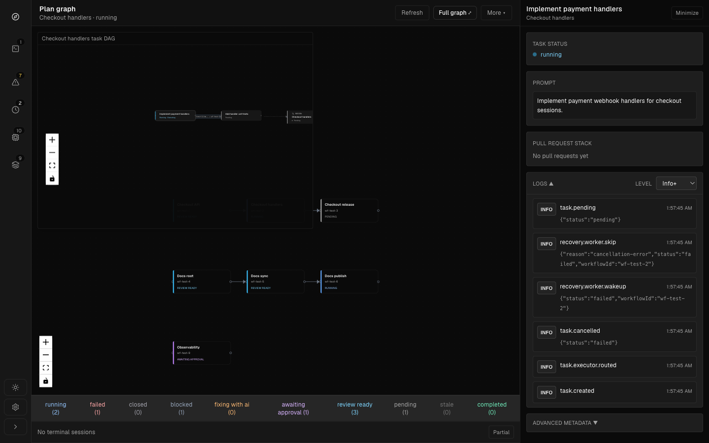
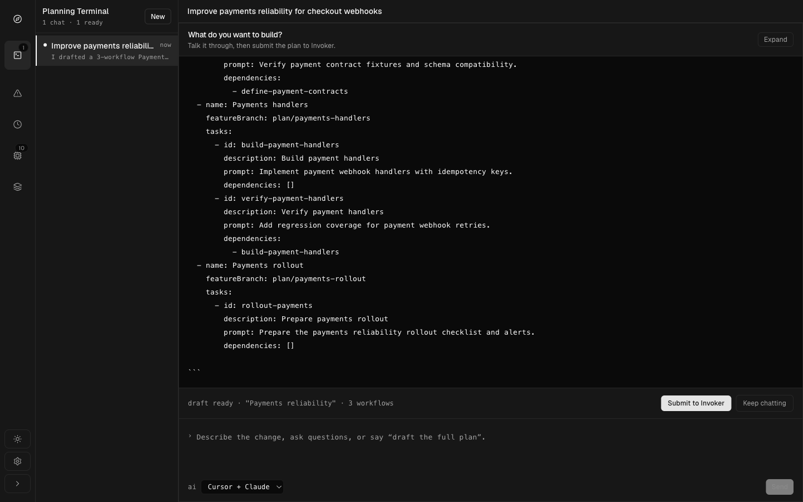
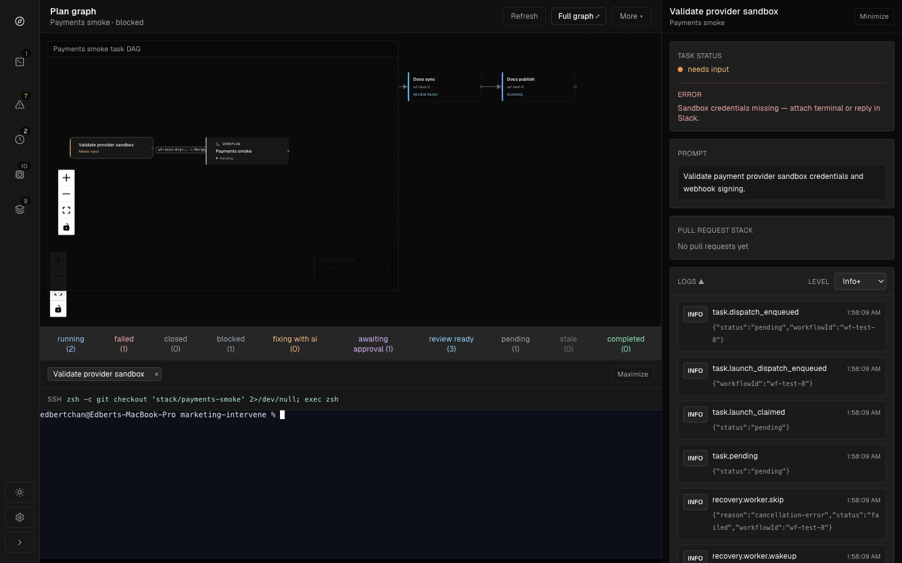
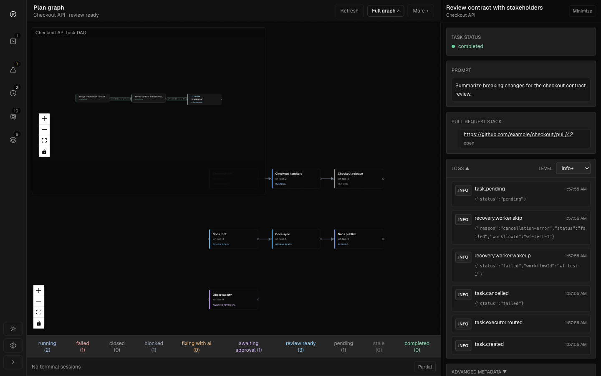
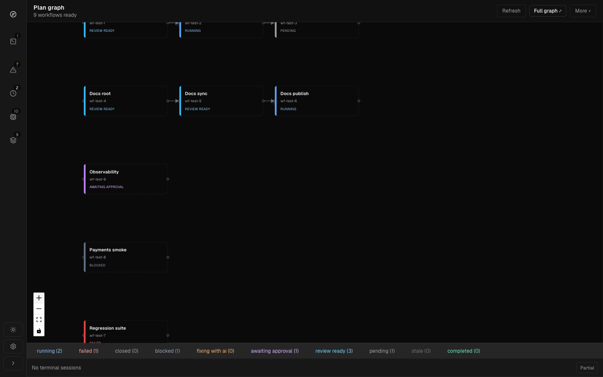

<div align="center">

# Invoker

**Persisted multi-agent workflow orchestration**

[](LICENSE)
[](https://github.com/Neko-Catpital-Labs/Invoker/releases/latest)
[](https://github.com/Neko-Catpital-Labs/Invoker/releases/latest)
[](https://www.npmjs.com/package/@neko-catpital-labs/invoker-cli)
[](https://www.npmjs.com/package/@neko-catpital-labs/invoker-ui)
[](https://www.npmjs.com/package/@neko-catpital-labs/invoker-slack)

A DAG of tasks in isolated git worktrees, composed through merge gates and review — desktop, CLI, and Slack on one control plane.

**[Download](https://github.com/Neko-Catpital-Labs/Invoker/releases/latest)** · **[Website](https://invoker-control.dev)**

<video src="docs/assets/invoker-preview.mp4" controls muted playsinline width="100%"></video>

[Watch the Invoker demo video](docs/assets/invoker-preview.mp4)

</div>

## Features

<table>
<tr>
<td width="50%" valign="top">

### Monitor execution

See parallel runs, dependencies, PRs, and replay paths in one stacked workflow graph — persistence is the source of truth, not process memory.

</td>
<td width="50%">



</td>
</tr>
<tr>
<td width="50%" valign="top">

### Drive with AI

Plan and run Codex, Claude, and other agents as first-class DAG nodes with explicit lineage and session audit trails.

</td>
<td width="50%">



</td>
</tr>
<tr>
<td width="50%" valign="top">

### Intervene and approve

Human gates are first-class states — approve, retry, or redirect without leaving the control plane.

</td>
<td width="50%">



</td>
</tr>
<tr>
<td width="50%" valign="top">

### Review work

Branches, merges, conflicts, and pull requests are part of the execution model — review stacked changes in context.

</td>
<td width="50%">



</td>
</tr>
<tr>
<td width="50%" valign="top">

### Control cloud and remote agents

Spread work across SSH targets and remote machines you already manage — same actions from desktop, CLI, or Slack.

</td>
<td width="50%">



</td>
</tr>
</table>

## Workers

Invoker recovery is driven by a worker registry, not a single hard-coded auto-fix loop. Built-in worker definitions are registered by stable kind; `autofix` remains the built-in default worker for failed-task recovery and submits normal `fix-with-agent` intents after reconciling persisted state.

Manual headless worker runs use the registered kind (`./run.sh --headless worker autofix`) and take a single-instance lock named for that kind, so a second `autofix` scan is refused without blocking other worker kinds. The same registry powers desktop worker status and start/stop controls.

External worker support is configured with `externalWorkers`, where each entry declares a registry `kind` and a `launch` command (`executable`, optional `args`, optional `cwd`). The loader registers each external worker kind and supervises its process boundary: start/wake launches the process, stop terminates it, and producers still only publish lifecycle wakeups rather than launching scripts directly.

## Install

```bash
npm install -g @neko-catpital-labs/invoker-ui
npm install -g @neko-catpital-labs/invoker-cli
npm install -g @neko-catpital-labs/invoker-slack
```

Or grab desktop builds and standalone binaries from [GitHub Releases](https://github.com/Neko-Catpital-Labs/Invoker/releases/latest). Full install, config, and source checkout steps: [Getting started](docs/getting-started.md).

Packaged installs bundle the first-party Invoker AI helpers inside the app. Install helpers from System Setup or:

```bash
invoker-ui --install-skills
```

Then, in Codex, Claude, Cursor, or OMP, run:

```text
/invoker-plan-to-invoker "help me plan <change>"
```

The command plans first, writes `plans/invoker-handoff.md`, converts it to `plans/invoker-handoff.yaml`, validates, and submits with `invoker-cli run --live` or the Invoker MCP tool.
## Docs

- [Getting started](docs/getting-started.md) — prerequisites, install, config, quick start, troubleshooting
- [Architecture](ARCHITECTURE.md) — package layering, mutation boundaries, error contracts
- [invoker-ops skill](skills/invoker-ops/SKILL.md) — operate existing workflows: retry, restart, cancel, or inspect blocked tasks
- [Slack native workflows](docs/slack-native-workflows.md) — lobby mentions, harness presets, per-workflow channels
- [First agent workflow tutorial](docs/tutorial-first-agent-workflow.md) — guided first run
- [Changelog](CHANGELOG.md)
- [Contributing](CONTRIBUTING.md)
- [License](LICENSE)

More: [local macOS release build](docs/local-macos-release-build.md), [remote SSH targets](docs/remote-ssh-targets.md), [Docker executor](docs/docker-executor.md), [web surface](docs/web-surface.md), [product story](docs/invoker-medium-article.md).

If you need to turn a product or implementation plan into an Invoker workflow, install helpers from System Setup or `invoker-ui --install-skills`, then run `/invoker-plan-to-invoker "help me plan <change>"` in Codex, Claude, Cursor, or OMP. The command plans first, writes `plans/invoker-handoff.md`, converts it to `plans/invoker-handoff.yaml`, validates, and submits with `invoker-cli run --live` or the Invoker MCP tool.
## License

[Functional Source License, Version 1.1, ALv2 Future License](LICENSE) (SPDX: **FSL-1.1-ALv2**). Permitted use, competing use, and the future Apache License 2.0 grant are defined in the license file.

Invoker also includes the **Neko Catpital Ventures, LLC Addendum** in [LICENSE](LICENSE). In plain terms, that addendum says:

- if you modify or redistribute the Software for commercial use, those modifications or redistributions must remain open source under the FSL and the NCV Addendum, and cannot be relicensed more restrictively
- you may build and exploit software or developments using Invoker, so long as Invoker itself is not incorporated into that software or those developments
- except for evaluation or testing, you may not use the Software to replace employees or reduce headcount for substantially similar roles for six months after first production use

The `LICENSE` file is the controlling text, including the full NCV Addendum.
