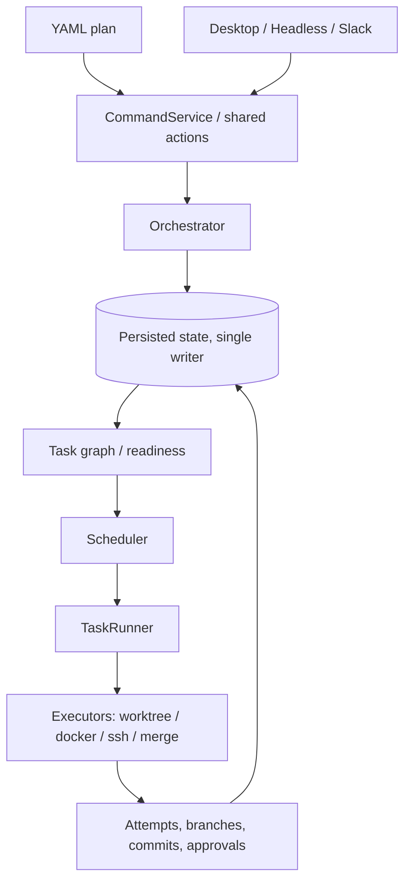

# Invoker

<video src="docs/assets/invoker-preview.mp4" controls muted playsinline width="100%"></video>

[Watch the Invoker demo video](docs/assets/invoker-preview.mp4)

**Persisted workflow orchestration: a DAG of tasks in isolated workspaces, composed through git branches, merge gates, and review.**

Current version: `0.0.4`. Version history lives in [CHANGELOG.md](CHANGELOG.md).

## Overview

| Problem | Invoker |
| --- | --- |
| Agent or terminal state is lost on restart | Persistence is the source of truth, not process memory |
| Hard to see what ran and on what inputs | Every execution is an addressable, replayable record with explicit lineage |
| Review/merge treated as "outside" the tool | Human gates are first-class states in the workflow lifecycle |
| Control actions racing each other | A single serialized control plane mediates every mutation |
| Multi-agent work becomes hard to supervise | Stacked workflow graphs show parallel runs, dependencies, PRs, and replay paths in one UI |

**What it is (one paragraph):** Invoker is a persisted workflow engine—not just a task list. It runs ready nodes under a concurrency cap, tracks explicit lifecycle states, preserves AI session audit trails, and treats **code changes** (branches, merges, conflicts, pull requests) as part of the execution model. Desktop UI, **headless** CLI, and Slack are surfaces on the same engine. Package boundaries and runtime invariants live in [ARCHITECTURE.md](ARCHITECTURE.md), and the longer product story lives in [docs/invoker-medium-article.md](docs/invoker-medium-article.md).

## Prerequisites

- **Node.js** 26.x (pinned in [package.json](package.json) and [.node-version](.node-version))
- **pnpm** (version pinned in `package.json`)
- **Git**

## Installation

```bash
git clone https://github.com/Neko-Catpital-Labs/Invoker.git invoker && cd invoker
pnpm install
bash scripts/setup-agent-skills.sh
pnpm run build
```

Invoker does not provision machines for you. You are responsible for bringing your own local workstation, VM, container host, or remote machines and making sure the required tools are installed there before running workflows.

If pnpm skips Electron's dependency install hook and you hit `Electron failed to install correctly`, rerun `pnpm install` or any normal launch command after allowing Electron's build script. Recent pnpm versions may require `pnpm approve-builds`.

For packaged installs, the repo includes npm launchers, direct GitHub Release downloads, an installer script, and a tag-driven release workflow.

### Standalone CLI

The downloaded standalone CLI binary does not require Node after installation. It can run plans directly, or delegate to a running Invoker desktop owner when one is available. The npm package is a launcher that installs and runs that bundled binary as `invoker-cli`.

Install with npm:

```bash
npm install -g @neko-catpital-labs/invoker-cli
invoker-cli --version
invoker-cli doctor
invoker-cli run plans/fixtures/hello-world.yaml --standalone
```

Or download the platform binary from GitHub Releases:

```bash
version=0.0.4
case "$(uname -s)" in
  Darwin) platform=darwin ;;
  Linux) platform=linux ;;
  *) echo "Unsupported OS" >&2; exit 1 ;;
esac
case "$(uname -m)" in
  arm64|aarch64) arch=arm64 ;;
  x86_64|amd64) arch=x64 ;;
  *) echo "Unsupported architecture" >&2; exit 1 ;;
esac
curl -L -o invoker-cli "https://github.com/Neko-Catpital-Labs/Invoker/releases/download/v${version}/invoker-cli-${version}-${platform}-${arch}"
chmod +x invoker-cli
./invoker-cli --version
./invoker-cli run plans/fixtures/hello-world.yaml --standalone
```

Release checksums are published as `SHA256SUMS`. To verify a downloaded binary:

```bash
curl -L -O "https://github.com/Neko-Catpital-Labs/Invoker/releases/download/v0.0.4/SHA256SUMS"
shasum -a 256 -c SHA256SUMS --ignore-missing
```

`invoker-cli doctor --fix` can install some missing runtime tools on a best-effort basis using Homebrew on macOS, apt on Linux, or npm for npm-based CLIs. Authentication-dependent setup, such as `gh auth login` and provider CLI login, remains manual.

`invoker-cli run <plan.yaml>` defaults to `auto` mode: it submits the plan to a running desktop owner over IPC when one is reachable, and otherwise runs the plan in a standalone CLI database at `~/.invoker-cli`. Use `--live` to require the desktop owner, `--standalone` to force isolated CLI execution, `--db-dir <path>` to choose a different standalone database directory, and `--json` for a machine-readable result summary.

### Desktop UI

Install the desktop UI launcher with npm:

```bash
npm install -g @neko-catpital-labs/invoker-ui
invoker-ui
invoker-ui doctor
```

Direct desktop downloads are also available from GitHub Releases:
- macOS: `.dmg` and `.zip`
- Linux: `.deb` and `.AppImage`

The macOS npm launcher uses the `.zip` app bundle asset so it does not need to mount a `.dmg`.

For source-based packaged installs, the repo includes an installer script:

```bash
curl -fsSL https://raw.githubusercontent.com/Neko-Catpital-Labs/Invoker/master/scripts/install.sh | bash
```

Tagged releases are configured to publish:
- standalone CLI binaries and `.tar.gz` archives for macOS and Linux on x64 and arm64
- desktop `.dmg`, `.zip`, `.deb`, and `.AppImage`
- `SHA256SUMS` covering release assets

Packaged installs bundle the first-party Invoker AI helpers inside the app. Install helpers from System Setup or:

```bash
invoker-ui --install-skills
```

Then, in Codex, Claude, Cursor, or OMP, run:

```text
/invoker-plan-to-invoker "help me plan <change>"
```

The command plans first, writes `plans/invoker-handoff.md`, converts it to `plans/invoker-handoff.yaml`, validates, and submits with `invoker-cli run --live` or the Invoker MCP tool.

Source checkouts can install the repo helpers with `bash scripts/setup-agent-skills.sh`.

## First tutorial

If you are new to Invoker, start with the guided first workflow:

[docs/tutorial-first-agent-workflow.md](docs/tutorial-first-agent-workflow.md)

The tutorial creates a tiny local git repo, generates both Codex and Claude plan files, then walks through the desktop UI: `Open`, `Start`, task graph inspection, terminal/log access, retry behavior, and how to adapt the same plan shape to your own project.

## Configuration

Invoker reads user config from `~/.invoker/config.json`.

If you want a repo-specific config file, point the app at it explicitly:

```bash
INVOKER_REPO_CONFIG_PATH=$PWD/.invoker.local.json ./run.sh
```

The config loader does not automatically read `<repo>/.invoker.json`.

Minimal example:

```json
{
  "maxConcurrency": 6,
  "autoFixRetries": 3,
  "autoFixAgent": "claude",
  "autoFixCi": false,
  "remoteTargets": {
    "staging-a": {
      "host": "203.0.113.10",
      "user": "invoker",
      "sshKeyPath": "/home/you/.ssh/invoker_staging_a",
      "managedWorkspaces": true,
      "remoteInvokerHome": "~/.invoker",
      "provisionCommand": "pnpm install --frozen-lockfile"
    },
    "staging-b": {
      "host": "203.0.113.11",
      "user": "invoker",
      "sshKeyPath": "/home/you/.ssh/invoker_staging_b",
      "managedWorkspaces": true,
      "remoteInvokerHome": "~/.invoker",
      "provisionCommand": "pnpm install --frozen-lockfile"
    }
  }
}
```

More examples: [docs/invoker-config-example.json](docs/invoker-config-example.json), [docs/remote-ssh-targets.md](docs/remote-ssh-targets.md), [docs/docker-executor.md](docs/docker-executor.md).

### Multiple SSH Executors

Define multiple entries under `remoteTargets`, then select them per task with `poolId`.

```yaml
name: multi-remote-example
repoUrl: git@github.com:your-org/your-repo.git
baseBranch: master
tasks:
  - id: test-a
    description: Run checks on remote target A
    command: pnpm test
    poolId: staging-a

  - id: test-b
    description: Run checks on remote target B
    command: pnpm test
    poolId: staging-b
```

Use this when you want Invoker to spread work across machines you already manage. The SSH executor does not provision the hosts for you; it connects to the target you name and runs there.

## Quick start

For a guided first run, use [the first agent workflow tutorial](docs/tutorial-first-agent-workflow.md). It gives you a toy repo and exact UI checkpoints.

For day-to-day use, start the desktop app:

```bash
./run.sh
```

Or run a plan through the headless surface:

```bash
./run.sh --headless --help
./run.sh --headless query workflows
./run.sh --headless run /path/to/plan.yaml
```

For app development with hot reload:

```bash
pnpm run dev:hot
```

GUI-launched workflows inherit the GUI app environment. On macOS, apps launched from Finder often have a narrower `PATH` than your terminal. If workflows need `pnpm`, `git`, `codex`, or `claude`, start Invoker from a terminal or make those tools available to GUI-launched apps.

**Example plan:**

```yaml
name: ai-feature-hardening
description: |
  Demonstrates a small AI implementation workflow with parallel code paths,
  an SSH-backed verification task, and a pull request review gate.
repoUrl: git@github.com:your-org/your-repo.git
baseBranch: main
onFinish: pull_request
mergeMode: external_review
tasks:
  - id: plan
    description: Ask an AI agent to produce a scoped implementation plan
    prompt: |
      Inspect the repository, identify the smallest implementation slice,
      and produce a concise plan with verification steps.
    executionAgent: codex
    dependencies: []

  - id: api
    description: Implement the API slice in an isolated worktree
    command: pnpm --filter @your-org/api test
    dependencies: [plan]

  - id: ui
    description: Implement the UI slice in an isolated worktree
    prompt: |
      Implement the UI affordance described by the plan. Preserve audit
      state so a failed task can be reopened, edited, and replayed.
    executionAgent: codex
    dependencies: [plan]

  - id: tests
    description: Run the final regression suite on a configured SSH executor
    command: pnpm run test:all
    poolId: staging-a
    dependencies: [api, ui]
```

If you need to turn a product or implementation plan into an Invoker workflow, install helpers from System Setup or `invoker-ui --install-skills`, then run `/invoker-plan-to-invoker "help me plan <change>"` in Codex, Claude, Cursor, or OMP. The command plans first, writes `plans/invoker-handoff.md`, converts it to `plans/invoker-handoff.yaml`, validates, and submits with `invoker-cli run --live` or the Invoker MCP tool.

If you need to operate existing workflows or tasks, use the `invoker-ops` skill.

Use `--output text|label|json|jsonl` on headless `query` commands. Use `./run.sh --headless retry-tasks --status pending|failed --parallel 8` for bulk safe retries. Inspect recovery ownership and decisions with `./run.sh --headless worker status --output text|json|jsonl`. Normal `run`, `resume`, and retry commands do not start recovery loops; recovery is owned by the explicit recovery worker path. Only **one** process should **write** the workflow database at a time; see [docs/persistence-architecture-single-writer.md](docs/persistence-architecture-single-writer.md).

### Auto-fix worker (single shared engine)

Auto-fix recovery runs through **one** shared worker engine in `@invoker/execution-engine`. Two doors reach that same single engine: `invoker-cli worker autofix` (production) and `./run.sh --headless worker autofix` (dev). Whichever door you use, the worker is **foreground** — it lives and dies with the process, with no detached background service. A single-instance lock means only one auto-fix worker runs at a time: a second start, from either door, refuses rather than spawning a second loop. A sweep-and-assert guard test fails the build if auto-fix is ever triggered outside this shared worker engine. See [docs/architecture/recovery-lifecycle-workers.md](docs/architecture/recovery-lifecycle-workers.md).

## Architecture (at a glance)



## Core concepts

- **Plan** — YAML: tasks, `dependencies`, defaults like `baseBranch`.
- **Workflow** — Persisted instance; generation and DB are source of truth.
- **Task / attempt** — DAG node plus immutable execution records; **selected attempt** drives downstream validity and staleness.
- **Executors** — `worktree`, `docker`, `ssh` (isolated workspaces).
- **Surfaces** — Same actions everywhere; mutations go through **CommandService** → **Orchestrator**.

Types: [packages/workflow-graph/src/types.ts](packages/workflow-graph/src/types.ts).

## Development

| Command | What it does |
| --- | --- |
| `pnpm run dev` | Build UI + app, start Electron |
| `pnpm run dev:hot` | Vite dev server + app |
| `pnpm run build` | Build all packages |
| `pnpm test` | Skill check + package tests (sequential) |
| `pnpm run test:e2e-chaos` | Run the seedable chaos battle-test matrix |
| `pnpm run test:high-resource` | Package tests in parallel |
| `pnpm run test:all` | Full aggregated test script |
| `pnpm run check:all` | Deps graph + types + owner boundary |

Layer rules: [ARCHITECTURE.md](ARCHITECTURE.md). Agent/repo conventions: [CLAUDE.md](CLAUDE.md).

## Documentation

| Doc | Use |
| --- | --- |
| [docs/tutorial-first-agent-workflow.md](docs/tutorial-first-agent-workflow.md) | Guided first run on a toy project using Codex or Claude |
| [ARCHITECTURE.md](ARCHITECTURE.md) | Package layering, mutation boundaries, error contracts |
| [docs/invoker-medium-article.md](docs/invoker-medium-article.md) | Product story, glossary, mapping tables |
| [docs/persistence-architecture-single-writer.md](docs/persistence-architecture-single-writer.md) | SQLite / sql.js single writer |
| [docs/invoker-config-example.json](docs/invoker-config-example.json) | Example `config.json` with local and remote executor settings |
| [docs/remote-ssh-targets.md](docs/remote-ssh-targets.md) | SSH executor setup, target fields, and plan examples |
| [docs/docker-executor.md](docs/docker-executor.md) | Docker executor configuration and runtime notes |
| [docs/slack-native-workflows.md](docs/slack-native-workflows.md) | Plan & drive workflows from Slack: lobby mentions, harness presets, per-workflow channels |
| [docs/web-surface.md](docs/web-surface.md) | Watch & drive workflows from a browser (HTTP+SSE) and the Slack live status card; enabling `INVOKER_WEB_TOKEN` |

## Troubleshooting

- **DB conflicts** — Do not run two writers on the same DB; headless CLI mutations use a standalone owner, while GUI-started workflows stay owned by the desktop app process.
- **`pnpm` or `git` not found from the desktop app** — On macOS this is often a Finder/GUI `PATH` issue. Launch Invoker from a terminal with `./run.sh`, or make the required binaries available to GUI-launched apps.
- **Missing bundled agent skills** — `bash scripts/setup-agent-skills.sh`
- **Install failures** — Use Node 26 as per `engines`
- **Obsidian (README / Mermaid)** — In **Source** mode the diagram stays plain text. Open **Reading view** (book icon in the header, or the *Toggle reading view* command). **Live Preview** usually renders Mermaid as well; if you see an empty box or a parse error, update Obsidian, try the default theme, and disable CSS snippets (some themes hide Mermaid).

## Contributing

Contributions are welcome — but Invoker is a control system, not a typical app, and changes have to respect the architectural commitments that make it useful (explicit state, narrow mutation paths, hard layer boundaries, executable verification). Read [CONTRIBUTING.md](CONTRIBUTING.md) before opening a PR.

Roadmap and issue tracker: [invoker.productlane.com/roadmap](https://invoker.productlane.com/roadmap).

## License

[Functional Source License, Version 1.1, ALv2 Future License](LICENSE) (SPDX: **FSL-1.1-ALv2**). Permitted use, competing use, and the future Apache License 2.0 grant are defined in the license file.

Invoker also includes the **Neko Catpital Ventures, LLC Addendum** in [LICENSE](LICENSE). In plain terms, that addendum says:

- if you modify or redistribute the Software for commercial use, those modifications or redistributions must remain open source under the FSL and the NCV Addendum, and cannot be relicensed more restrictively
- you may build and exploit software or developments using Invoker, so long as Invoker itself is not incorporated into that software or those developments
- except for evaluation or testing, you may not use the Software to replace employees or reduce headcount for substantially similar roles for six months after first production use

The `LICENSE` file is the controlling text, including the full NCV Addendum.
