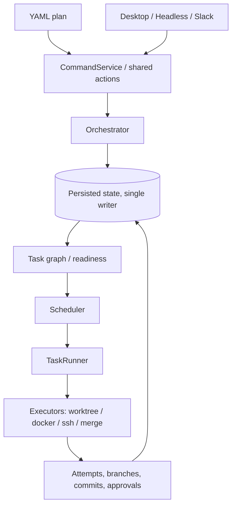

# Invoker

**Persisted workflow orchestration: a DAG of tasks in isolated workspaces, composed through git branches, merge gates, and review.**

Current version: `0.0.1`. Version history lives in [CHANGELOG.md](CHANGELOG.md).

## Overview

| Problem | Invoker |
| --- | --- |
| Agent or terminal state is lost on restart | Persistence is the source of truth, not process memory |
| Hard to see what ran and on what inputs | Every execution is an addressable, replayable record with explicit lineage |
| Review/merge treated as "outside" the tool | Human gates are first-class states in the workflow lifecycle |
| Control actions racing each other | A single serialized control plane mediates every mutation |

**What it is (one paragraph):** Invoker is a persisted workflow engine—not just a task list. It runs ready nodes under a concurrency cap, tracks explicit lifecycle states, and treats **code changes** (branches, merges, conflicts) as part of the execution model. Desktop UI, **headless** CLI, and Slack are surfaces on the same engine. Details: [docs/architecture-overview.md](docs/architecture-overview.md), longer narrative: [docs/invoker-medium-article.md](docs/invoker-medium-article.md).

## Prerequisites

- **Node.js** 22.x (`>=22 <23`, see [package.json](package.json))
- **pnpm** (version pinned in `package.json`)
- **Git**

## Installation

```bash
git clone <repository-url> invoker && cd invoker
pnpm install
bash scripts/setup-agent-skills.sh
pnpm run build
```

Invoker does not provision machines for you. You are responsible for bringing your own local workstation, VM, container host, or remote machines and making sure the required tools are installed there before running workflows.

For packaged installs, the repo includes an installer script and a tag-driven release workflow:

```bash
curl -fsSL https://raw.githubusercontent.com/Neko-Catpital-Labs/Invoker/master/scripts/install.sh | bash
```

Tagged releases are configured to publish:
- macOS: `.dmg`
- Linux: `.deb` and `.AppImage`

Packaged installs bundle the first-party Invoker skills inside the app. On first GUI launch, Invoker prompts you to install those skills into the supported global skill directories for Codex, Claude, and Cursor using `invoker-`-prefixed names so they do not overwrite existing skills. For headless/package-only usage, install the same bundled skills explicitly with:

```bash
invoker --install-skills
```

## Configuration

Invoker reads user config from `~/.invoker/config.json`.

If you want a repo-specific config file, point the app at it explicitly:

```bash
INVOKER_REPO_CONFIG_PATH=$PWD/.invoker.local.json ./run.sh
```

The config loader does not automatically read `<repo>/.invoker.json`.

Minimal example:

```json
{
  "maxConcurrency": 3,
  "autoFixRetries": 3,
  "autoFixAgent": "claude",
  "remoteTargets": {
    "staging-a": {
      "host": "203.0.113.10",
      "user": "invoker",
      "sshKeyPath": "/home/you/.ssh/invoker_staging_a",
      "managedWorkspaces": true,
      "remoteInvokerHome": "~/.invoker",
      "provisionCommand": "pnpm install --frozen-lockfile"
    },
    "staging-b": {
      "host": "203.0.113.11",
      "user": "invoker",
      "sshKeyPath": "/home/you/.ssh/invoker_staging_b",
      "managedWorkspaces": true,
      "remoteInvokerHome": "~/.invoker",
      "provisionCommand": "pnpm install --frozen-lockfile"
    }
  }
}
```

More examples: [docs/invoker-config-example.json](docs/invoker-config-example.json), [docs/remote-ssh-targets.md](docs/remote-ssh-targets.md), [docs/docker-executor.md](docs/docker-executor.md).

### Multiple SSH Executors

Define multiple entries under `remoteTargets`, then select them per task with `executorType: ssh` and `remoteTargetId`.

```yaml
name: multi-remote-example
repoUrl: git@github.com:your-org/your-repo.git
baseBranch: master
tasks:
  - id: test-a
    description: Run checks on remote target A
    command: pnpm test
    executorType: ssh
    remoteTargetId: staging-a

  - id: test-b
    description: Run checks on remote target B
    command: pnpm test
    executorType: ssh
    remoteTargetId: staging-b
```

Use this when you want Invoker to spread work across machines you already manage. The SSH executor does not provision the hosts for you; it connects to the target you name and runs there.

## Quick start

Start here if you want to get Invoker running locally with the smallest possible setup.

If you need to turn a product or implementation plan into an Invoker workflow, use the `plan-to-invoker` skill. Repo installs can link it with `bash scripts/setup-agent-skills.sh`. Packaged installs can install the bundled `invoker-plan-to-invoker` copy from the first-run System Setup prompt or with `invoker --install-skills`. The canonical skill source lives at [skills/plan-to-invoker/SKILL.md](skills/plan-to-invoker/SKILL.md), and its deterministic validation entrypoint is `bash skills/plan-to-invoker/scripts/skill-doctor.sh <plan-file>`.

1. Install the prerequisites above.
2. Clone the repo and run the installation commands.
3. Start Invoker with `./run.sh`. It will bootstrap missing workspace dependencies and build what it needs before launching.
4. Choose one surface:
   - Desktop UI: `./run.sh`
   - Headless CLI: `./run.sh --headless ...`
   - App development with hot reload: `pnpm run dev:hot`
5. Point Invoker at a plan and at the machines you already control. Invoker orchestrates work across configured executors; it does not create or provision those machines for you.

**Desktop app:**

```bash
./run.sh
```

**Headless**:

```bash
./run.sh --headless --help
./run.sh --headless query workflows
./run.sh --headless run /path/to/plan.yaml
```

Mutating headless CLI commands use a standalone headless owner process. They do not delegate execution into the desktop GUI process, even if the GUI app is already running. Read-only shared queries such as `query queue` and `query ui-perf` may still talk to an existing owner.

GUI-launched workflows still inherit the GUI app environment. On macOS, apps launched from Finder often have a narrower `PATH` than your terminal. If you start workflows from the desktop app, make sure tools like `pnpm`, `git`, and any configured agent CLIs are available to the GUI launch context.

**Hot-reload app development**:

```bash
pnpm run dev:hot
```

Use `--output text|label|json|jsonl` on `query` commands. Only **one** process should **write** the workflow database at a time; see [docs/persistence-architecture-single-writer.md](docs/persistence-architecture-single-writer.md).

**Example plan:**

```yaml
name: ci-hardening
baseBranch: main
tasks:
  - id: deps
    description: Install dependencies
    command: pnpm install --frozen-lockfile
  - id: tests
    description: Run tests
    command: pnpm test
    dependencies: [deps]
```

## Architecture (at a glance)



## Core concepts

- **Plan** — YAML: tasks, `dependencies`, defaults like `baseBranch`.
- **Workflow** — Persisted instance; generation and DB are source of truth.
- **Task / attempt** — DAG node plus immutable execution records; **selected attempt** drives downstream validity and staleness.
- **Executors** — `worktree`, `docker`, `ssh` (isolated workspaces).
- **Surfaces** — Same actions everywhere; mutations go through **CommandService** → **Orchestrator**.

Types: [packages/workflow-graph/src/types.ts](packages/workflow-graph/src/types.ts).

## Development

| Command | What it does |
| --- | --- |
| `pnpm run dev` | Build UI + app, start Electron |
| `pnpm run dev:hot` | Vite dev server + app |
| `pnpm run build` | Build all packages |
| `pnpm test` | Skill check + package tests (sequential) |
| `pnpm run test:e2e-chaos` | Run the seedable chaos battle-test matrix |
| `pnpm run test:high-resource` | Package tests in parallel |
| `pnpm run test:all` | Full aggregated test script |
| `pnpm run check:all` | Deps graph + types + owner boundary |

Layer rules: [ARCHITECTURE.md](ARCHITECTURE.md). Agent/repo conventions: [CLAUDE.md](CLAUDE.md).

## Documentation

| Doc | Use |
| --- | --- |
| [docs/architecture-overview.md](docs/architecture-overview.md) | Runtime layers, scheduler, comparisons |
| [docs/invoker-medium-article.md](docs/invoker-medium-article.md) | Product story, glossary, mapping tables |
| [docs/persistence-architecture-single-writer.md](docs/persistence-architecture-single-writer.md) | SQLite / sql.js single writer |
| [docs/invoker-config-example.json](docs/invoker-config-example.json) | Example `config.json` with local and remote executor settings |
| [docs/remote-ssh-targets.md](docs/remote-ssh-targets.md) | SSH executor setup, target fields, and plan examples |
| [docs/docker-executor.md](docs/docker-executor.md) | Docker executor configuration and runtime notes |

## Troubleshooting

- **DB conflicts** — Do not run two writers on the same DB; headless CLI mutations use a standalone owner, while GUI-started workflows stay owned by the desktop app process.
- **`pnpm` or `git` not found from the desktop app** — On macOS this is often a Finder/GUI `PATH` issue. Launch Invoker from a terminal with `./run.sh`, or make the required binaries available to GUI-launched apps.
- **Missing Cursor skills** — `bash scripts/setup-agent-skills.sh`
- **Install failures** — Use Node 22 as per `engines`
- **Obsidian (README / Mermaid)** — In **Source** mode the diagram stays plain text. Open **Reading view** (book icon in the header, or the *Toggle reading view* command). **Live Preview** usually renders Mermaid as well; if you see an empty box or a parse error, update Obsidian, try the default theme, and disable CSS snippets (some themes hide Mermaid).

## Contributing

Contributions are welcome — but Invoker is a control system, not a typical app, and changes have to respect the architectural commitments that make it useful (explicit state, narrow mutation paths, hard layer boundaries, executable verification). Read [CONTRIBUTING.md](CONTRIBUTING.md) before opening a PR.

Roadmap and issue tracker: [invoker.productlane.com/roadmap](https://invoker.productlane.com/roadmap).

## License

[Functional Source License, Version 1.1, ALv2 Future License](LICENSE) (SPDX: **FSL-1.1-ALv2**). Permitted use, competing use, and the future Apache License 2.0 grant are defined in the license file.

Invoker also includes the **Neko Catpital Ventures, LLC Addendum** in [LICENSE](LICENSE). In plain terms, that addendum says:

- if you modify or redistribute the Software for commercial use, those modifications or redistributions must remain open source under the FSL and the NCV Addendum, and cannot be relicensed more restrictively
- you may build and exploit software or developments using Invoker, so long as Invoker itself is not incorporated into that software or those developments
- except for evaluation or testing, you may not use the Software to replace employees or reduce headcount for substantially similar roles for six months after first production use

The `LICENSE` file is the controlling text, including the full NCV Addendum.
