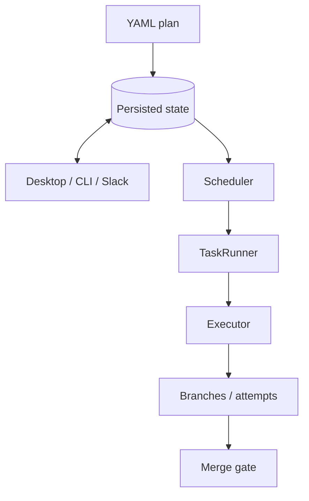

# Invoker

**Persisted workflow orchestration: a DAG of tasks in isolated workspaces, composed through git branches, merge gates, and review.**

## Overview

| Problem | Invoker |
| --- | --- |
| Agent or terminal state is lost on restart | Durable workflow + task state on disk |
| Hard to see what ran and on what inputs | Attempts, lineage, `WorkRequest` / `WorkResponse` |
| Review/merge treated as "outside" the tool | Merge gates and approvals as workflow states |
| Control actions racing each other | `CommandService` serializes mutations per workflow |

**What it is (one paragraph):** Invoker is a persisted workflow engine—not just a task list. It runs ready nodes under a concurrency cap, tracks explicit lifecycle states, and treats **code changes** (branches, merges, conflicts) as part of the execution model. Desktop UI, **headless** CLI, and Slack are surfaces on the same engine. Details: [docs/architecture-overview.md](docs/architecture-overview.md), longer narrative: [docs/invoker-medium-article.md](docs/invoker-medium-article.md).

## Prerequisites

- **Node.js** 22.x (`>=22 <23`, see [package.json](package.json))
- **pnpm** (version pinned in `package.json`)
- **Git**
- **Electron** (app + headless share `packages/app` main process)

## Installation

```bash
git clone <repository-url> invoker && cd invoker
pnpm install
bash scripts/setup-agent-skills.sh
pnpm run build
```

## Quick start

```bash
# Desktop app
pnpm dev

# UI hot reload (Vite + app)
pnpm run dev:hot
```

**Headless** (after `pnpm run build`):

```bash
cd packages/app
pnpm exec electron dist/main.js --headless --help
pnpm exec electron dist/main.js --headless query workflows
pnpm exec electron dist/main.js --headless run /path/to/plan.yaml
```

Use `--output text|label|json|jsonl` on `query` commands. Only **one** process should **write** the workflow database at a time; see [docs/persistence-architecture-single-writer.md](docs/persistence-architecture-single-writer.md).

**Example plan:**

```yaml
name: ci-hardening
baseBranch: main
tasks:
  - id: deps
    description: Install dependencies
    command: pnpm install --frozen-lockfile
  - id: tests
    description: Run tests
    command: pnpm test
    dependencies: [deps]
```

## Architecture (at a glance)

Mermaid source: [docs/invoker-end-to-end-happy-path.mmd](docs/invoker-end-to-end-happy-path.mmd). Layered diagram + PNG: [docs/architecture-overview.md](docs/architecture-overview.md#end-to-end-control-flow), [docs/invoker-architecture-overview.png](docs/invoker-architecture-overview.png).



## Core concepts

- **Plan** — YAML: tasks, `dependencies`, defaults like `baseBranch`.
- **Workflow** — Persisted instance; generation and DB are source of truth.
- **Task / attempt** — DAG node plus immutable execution records; **selected attempt** drives downstream validity and staleness.
- **Executors** — `worktree`, `docker`, `ssh` (isolated workspaces).
- **Surfaces** — Same actions everywhere; mutations go through **CommandService** → **Orchestrator**.

Types: [packages/workflow-graph/src/types.ts](packages/workflow-graph/src/types.ts).

## Development

| Command | What it does |
| --- | --- |
| `pnpm dev` | Build UI + app, start Electron |
| `pnpm run dev:hot` | Vite dev server + app |
| `pnpm run build` | Build all packages |
| `pnpm test` | Skill check + package tests (sequential) |
| `pnpm run test:high-resource` | Package tests in parallel |
| `pnpm run test:all` | Full aggregated test script |
| `pnpm run check:all` | Deps graph + types + owner boundary |

Layer rules: [ARCHITECTURE.md](ARCHITECTURE.md). Agent/repo conventions: [CLAUDE.md](CLAUDE.md).

## Documentation

| Doc | Use |
| --- | --- |
| [docs/architecture-overview.md](docs/architecture-overview.md) | Runtime layers, scheduler, comparisons |
| [docs/invoker-medium-article.md](docs/invoker-medium-article.md) | Product story, glossary, mapping tables |
| [docs/architecture-overview.html](docs/architecture-overview.html) | Browser-friendly overview |
| [docs/persistence-architecture-single-writer.md](docs/persistence-architecture-single-writer.md) | SQLite / sql.js single writer |

## Troubleshooting

- **DB conflicts** — Do not run two writers on the same DB; use the owning process for mutating headless commands.
- **Missing Cursor skills** — `bash scripts/setup-agent-skills.sh`
- **Install failures** — Use Node 22 as per `engines`
- **Obsidian (README / Mermaid)** — In **Source** mode the diagram stays plain text. Open **Reading view** (book icon in the header, or the *Toggle reading view* command). **Live Preview** usually renders Mermaid as well; if you see an empty box or a parse error, update Obsidian, try the default theme, and disable CSS snippets (some themes hide Mermaid).

## License

[Functional Source License, Version 1.1, MIT Future License](LICENSE) (SPDX: **FSL-1.1-MIT**). Permitted use, competing use, and future MIT grant are defined in the license file.
