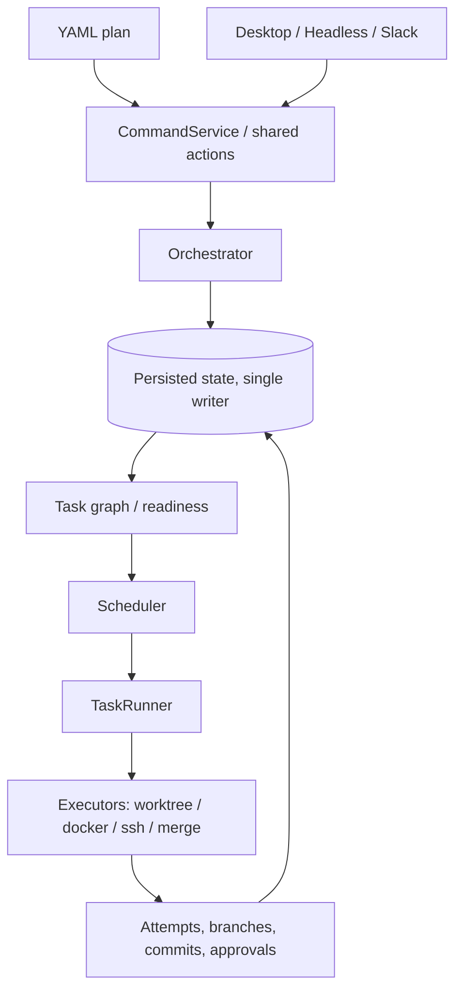

# Invoker

**Persisted workflow orchestration: a DAG of tasks in isolated workspaces, composed through git branches, merge gates, and review.**

Current version: `0.1.0`. Version history lives in [CHANGELOG.md](CHANGELOG.md).

## Overview

| Problem | Invoker |
| --- | --- |
| Agent or terminal state is lost on restart | Persistence is the source of truth, not process memory |
| Hard to see what ran and on what inputs | Every execution is an addressable, replayable record with explicit lineage |
| Review/merge treated as "outside" the tool | Human gates are first-class states in the workflow lifecycle |
| Control actions racing each other | A single serialized control plane mediates every mutation |

**What it is (one paragraph):** Invoker is a persisted workflow engine—not just a task list. It runs ready nodes under a concurrency cap, tracks explicit lifecycle states, and treats **code changes** (branches, merges, conflicts) as part of the execution model. Desktop UI, **headless** CLI, and Slack are surfaces on the same engine. Details: [docs/architecture-overview.md](docs/architecture-overview.md), longer narrative: [docs/invoker-medium-article.md](docs/invoker-medium-article.md).

## Prerequisites

- **Node.js** 22.x (`>=22 <23`, see [package.json](package.json))
- **pnpm** (version pinned in `package.json`)
- **Git**
- **Electron** (app + headless share `packages/app` main process)

## Installation

```bash
git clone <repository-url> invoker && cd invoker
pnpm install
bash scripts/setup-agent-skills.sh
pnpm run build
```

Invoker does not provision machines for you. You are responsible for bringing your own local workstation, VM, container host, or remote machines and making sure the required tools are installed there before running workflows.

## Quick start

Start here if you want to get Invoker running locally with the smallest possible setup.

If you need to turn a product or implementation plan into an Invoker workflow, use the `plan-to-invoker` skill that `bash scripts/setup-agent-skills.sh` links into supported agents. The canonical skill lives at [skills/plan-to-invoker/SKILL.md](skills/plan-to-invoker/SKILL.md), and its deterministic validation entrypoint is `bash skills/plan-to-invoker/scripts/skill-doctor.sh <plan-file>`.

1. Install the prerequisites above.
2. Clone the repo and run the installation commands.
3. Start Invoker with `./run.sh`. It will bootstrap missing workspace dependencies and build what it needs before launching.
4. Choose one surface:
   - Desktop UI: `./run.sh`
   - Headless CLI: `./run.sh --headless ...`
   - App development with hot reload: `pnpm run dev:hot`
5. Point Invoker at a plan and at the machines you already control. Invoker orchestrates work across configured executors; it does not create or provision those machines for you.

**Desktop app:**

```bash
./run.sh
```

**Headless**:

```bash
./run.sh --headless --help
./run.sh --headless query workflows
./run.sh --headless run /path/to/plan.yaml
```

**Hot-reload app development**:

```bash
pnpm run dev:hot
```

Use `--output text|label|json|jsonl` on `query` commands. Only **one** process should **write** the workflow database at a time; see [docs/persistence-architecture-single-writer.md](docs/persistence-architecture-single-writer.md).

**Example plan:**

```yaml
name: ci-hardening
baseBranch: main
tasks:
  - id: deps
    description: Install dependencies
    command: pnpm install --frozen-lockfile
  - id: tests
    description: Run tests
    command: pnpm test
    dependencies: [deps]
```

## Architecture (at a glance)



## Core concepts

- **Plan** — YAML: tasks, `dependencies`, defaults like `baseBranch`.
- **Workflow** — Persisted instance; generation and DB are source of truth.
- **Task / attempt** — DAG node plus immutable execution records; **selected attempt** drives downstream validity and staleness.
- **Executors** — `worktree`, `docker`, `ssh` (isolated workspaces).
- **Surfaces** — Same actions everywhere; mutations go through **CommandService** → **Orchestrator**.

Types: [packages/workflow-graph/src/types.ts](packages/workflow-graph/src/types.ts).

## Development

| Command | What it does |
| --- | --- |
| `pnpm dev` | Build UI + app, start Electron |
| `pnpm run dev:hot` | Vite dev server + app |
| `pnpm run build` | Build all packages |
| `pnpm test` | Skill check + package tests (sequential) |
| `pnpm run test:high-resource` | Package tests in parallel |
| `pnpm run test:all` | Full aggregated test script |
| `pnpm run check:all` | Deps graph + types + owner boundary |

Layer rules: [ARCHITECTURE.md](ARCHITECTURE.md). Agent/repo conventions: [CLAUDE.md](CLAUDE.md).

## Documentation

| Doc | Use |
| --- | --- |
| [docs/architecture-overview.md](docs/architecture-overview.md) | Runtime layers, scheduler, comparisons |
| [docs/invoker-medium-article.md](docs/invoker-medium-article.md) | Product story, glossary, mapping tables |
| [docs/architecture-overview.html](docs/architecture-overview.html) | Browser-friendly overview |
| [docs/persistence-architecture-single-writer.md](docs/persistence-architecture-single-writer.md) | SQLite / sql.js single writer |

## Troubleshooting

- **DB conflicts** — Do not run two writers on the same DB; use the owning process for mutating headless commands.
- **Missing Cursor skills** — `bash scripts/setup-agent-skills.sh`
- **Install failures** — Use Node 22 as per `engines`
- **Obsidian (README / Mermaid)** — In **Source** mode the diagram stays plain text. Open **Reading view** (book icon in the header, or the *Toggle reading view* command). **Live Preview** usually renders Mermaid as well; if you see an empty box or a parse error, update Obsidian, try the default theme, and disable CSS snippets (some themes hide Mermaid).

## Contributing

Contributions are welcome — but Invoker is a control system, not a typical app, and changes have to respect the architectural commitments that make it useful (explicit state, narrow mutation paths, hard layer boundaries, executable verification). Read [CONTRIBUTING.md](CONTRIBUTING.md) before opening a PR.

Roadmap and issue tracker: [invoker.productlane.com/roadmap](https://invoker.productlane.com/roadmap).

## License

[Functional Source License, Version 1.1, MIT Future License](LICENSE) (SPDX: **FSL-1.1-MIT**). Permitted use, competing use, and future MIT grant are defined in the license file.

invoker-dogfood step1 20260417183816
