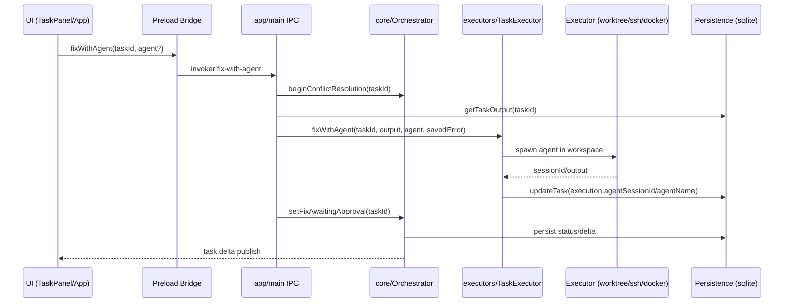
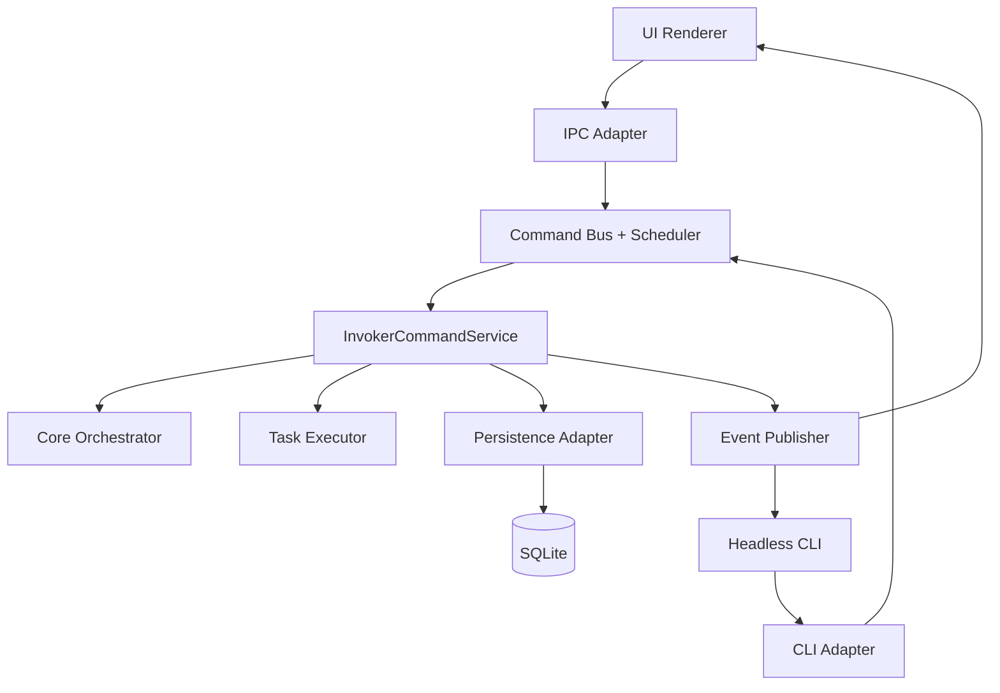

# Invoker Architecture Audit (2026-04-03)

## Summary
This audit covers architecture shape, abstraction boundaries, and test gaps across the repository.

Evidence sampled:
- Branch/ref surface: `origin/*` has 7,729 `experiment/*` refs, 71 `plan/*`, 62 `invoker/*`.
- Churn hotspots since 2025-01-01: `packages/app/src/main.ts` (171), `packages/core/src/orchestrator.ts` (113), `packages/executors/src/task-executor.ts` (105), `packages/executors/src/worktree-executor.ts` (69), `packages/persistence/src/sqlite-adapter.ts` (62).

## Architecture Visualization
### Package Dependency Graph
```mermaid
graph TD
  UI[@invoker/ui]
  APP[@invoker/app]
  SURF[@invoker/surfaces]
  CORE[@invoker/core]
  EXEC[@invoker/executors]
  PERSIST[@invoker/persistence]
  GRAPH[@invoker/graph]
  PROTO[@invoker/protocol]
  TRAN[@invoker/transport]
  TEST[@invoker/test-utils]

  APP --> CORE
  APP --> EXEC
  APP --> PERSIST
  APP --> PROTO
  APP --> SURF
  APP --> TRAN

  SURF --> CORE
  SURF --> EXEC
  SURF --> PERSIST
  SURF --> PROTO
  SURF --> TRAN

  CORE --> GRAPH
  CORE --> PROTO

  EXEC --> CORE
  EXEC --> PERSIST
  EXEC --> PROTO

  PERSIST --> CORE

  TEST --> CORE
  TEST --> EXEC
  TEST --> PROTO

  UI -.IPC/API.-> APP
```

### Runtime Flow (Fix/Conflict Path)


## Findings: Leaky Abstractions

### P0: Workspace Invariant Leak (optional type, required runtime)
Why it leaks:
- Cross-package types model `workspacePath` as optional in runtime execution state (`TaskExecution.workspacePath?: string`).
- Conflict/fix executors require non-empty existing workspace and throw hard if missing.
- Merge-gate/manual paths can persist `workspacePath: undefined` intentionally, creating states that violate executor assumptions.

Evidence:
- Optional contract: `packages/graph/src/types.ts:67`, `packages/executors/src/executor.ts:10`, `packages/executors/src/executor.ts:32`.
- Hard requirement: `packages/executors/src/conflict-resolver.ts:313-319`, `packages/executors/src/conflict-resolver.ts:78-80`.
- Undefined persisted in path: `packages/executors/src/merge-executor.ts:263-271`, `packages/executors/src/merge-executor.ts:300-303`.
- User-visible failure string matches this mismatch: `fixWithAgent ... has no valid workspace (workspacePath=undefined)`.

### P1: Main-process IPC boundary is overloaded and couples orchestration details
Why it leaks:
- `app/main.ts` owns 44 IPC handlers and performs orchestration sequencing directly (orchestrator + executor + persistence calls in one handler).
- This increases policy drift risk between GUI/headless/surfaces and makes invariants easy to violate outside core boundaries.

Evidence:
- Handler count and concentration: `packages/app/src/main.ts` (44 `ipcMain.handle` registrations).
- Mixed orchestration/persistence/executor sequencing in one path: `packages/app/src/main.ts:1196-1208`.
- Churn hotspot: 171 changes since 2025-01-01.

### P1: “Single-writer persistence” abstraction is partial in practice
Why it leaks:
- Core states DB as single source of truth and single mutation path.
- Writer lock is opt-in and disabled by default, leaving multi-process write safety dependent on environment discipline.

Evidence:
- Single-writer claim: `packages/core/src/orchestrator.ts:2-13`.
- Lock disabled by default unless env enabled: `packages/app/src/db-writer-lock.ts:12-18`.

### P2: Fallback-heavy boundaries blur ownership and hide defects
Why it leaks:
- Multiple `best effort` catch blocks and fallback modes across merge/worktree/session recovery weaken fail-fast guarantees.
- Some fallbacks are safety-positive, but collectively they make behavior stateful and branch-history dependent.

Evidence:
- Best-effort catches in critical paths: `packages/executors/src/base-executor.ts:530`, `packages/executors/src/merge-executor.ts:28`, `packages/core/src/orchestrator.ts:29-33`.
- Host repo fallback warning still exists in merge worktree creation path: `packages/executors/src/task-executor.ts:712-723`.
- High churn around these seams from recent fixes and refactors (`task-executor`, `merge-executor`, `conflict-resolver`).

## Test Gap Matrix

| Priority | Gap | Why risk is high | Current evidence |
|---|---|---|---|
| P0 | Missing end-to-end regression for startup failure + later fix path when workspace metadata is absent | This is exactly the failure mode in current incident (`workspacePath=undefined`) | Unit tests focus on dispatch/persistence happy-paths; no full path from startup failure to fix retry in managed workspace |
| P0 | Contract tests do not enforce workspace invariant before fix/resolve entrypoints | Runtime can enter non-fixable states despite UI exposing fix action | Tests explicitly accept `workspacePath: undefined` in merge-node awaiting-approval flows (`task-executor.test.ts:1746-1750`, `1976-1980`) |
| P1 | SSH remote fix/resolve has limited integration coverage | Remote path behavior diverges from local and depends on fs existence heuristics | `conflict-resolver.test.ts` explicitly notes real SSH path is not fully tested (`370-426`) |
| P1 | Snapshot merge-conflict pressure in visual-proof artifact | Snapshot conflicts repeatedly break startup/merge flows and branch rebases | `visual-proof-snapshots.test.tsx.snap` touched 8 times since 2025-01-01; recent conflict surfaced in task startup |
| P2 | Multi-process writer safety not exercised under default settings | Single-writer claim can be violated unless env opt-in is set | Writer-lock tests exist, but lock default is off (`db-writer-lock.ts:12-18`) |

## Recommended Remediation Sequence
1. Establish a hard `WorkspaceReady` invariant before any fix/resolve action (type-level + runtime guard in one shared gate).
2. Move fix/resolve orchestration out of `app/main` handlers into a dedicated application service boundary consumed by IPC/headless/surfaces.
3. Split `workspacePath` semantics into explicit states (`managed`, `none`, `remote`) instead of plain optional string.
4. Add deterministic regression suite for startup-failure-to-fix-retry (local + SSH variants).
5. Reduce snapshot conflict surface (smaller snapshots, deterministic ordering/timezone normalization, or image artifact split by workflow scope).

## UI + Headless Concurrency Architecture (Control-Plane Fix)
Both UI and headless currently act as mutating control surfaces over shared core state. To remove race windows, treat them as thin clients over one writer control plane:



Key control-plane rules:
1. `InvokerCommandService` is the only mutating boundary.
2. UI IPC and headless commands both become adapters (validate -> translate -> enqueue).
3. Command processing is serialized with per-task/per-workflow locks plus idempotency keys.
4. DB writer lock defaults to ON for runtime; bypass is test/dev-only.
5. Post-commit event publication is canonicalized (single source of state deltas).

## Phased Implementation + Secure Regression Plan

### Phase 1: Single Mutating Service Boundary
- Refactor mutating paths from `app/main` and `headless` into `InvokerCommandService`.
- Keep both surfaces as non-mutating transport adapters.
- Security/regression tests:
1. Adapter contract tests: UI/headless call same command service APIs.
2. Guardrail test: no direct adapter writes to orchestrator/persistence.
3. Command schema snapshot tests for cross-surface compatibility.

### Phase 2: Command Bus, Serialization, Idempotency
- Introduce `CommandEnvelope` with command ID, source, scope (`taskId`/`workflowId`), idempotency key.
- Add global/workflow/task-level scheduling gates to prevent conflicting parallel mutations.
- Security/regression tests:
1. Concurrency tests for same-command submission from UI and headless.
2. Interleaving/fuzz tests for `fix/recreate/retry/cancel` command races.
3. Duplicate replay tests to verify idempotent single-apply behavior.

### Phase 3: Mandatory Writer Lock + Process Contention Policy
- Flip writer lock behavior to default-on in runtime environments.
- Standardize lock-contention errors and recovery guidance.
- Security/regression tests:
1. Multi-process integration tests ensuring second writer is blocked.
2. Environment policy tests ensuring bypass flags are disallowed in production profiles.
3. Crash/restart recovery tests for stale lock cleanup paths.

### Phase 4: Optimistic Concurrency at Persistence Layer
- Add version/compare-and-swap semantics for critical task/workflow updates.
- Centralize stale-write retries in command service, not adapters.
- Security/regression tests:
1. Stale update race simulations with deterministic expected outcomes.
2. Monotonic version invariant tests across retries.
3. Regression tests for merge/fix workflows under concurrent command load.

### Phase 5: Unified Eventing + Read Consistency
- Publish one canonical post-commit event stream from command service.
- Remove ad-hoc refresh paths that expose transient state divergence.
- Security/regression tests:
1. Event ordering tests for causal task/workflow state transitions.
2. Read-after-write consistency tests across UI and headless observers.
3. Backward compatibility tests for existing subscribers/consumers.

### Cross-Phase Quality Gates (Required Every Phase)
1. Existing package tests + new targeted concurrency suite must pass.
2. Incident-derived regression tests (including workspace metadata loss scenarios) must pass.
3. Integration lane must run with writer lock enabled.
4. Command audit logs must include `commandId`, `source`, `idempotencyKey`, and outcome.

## Dependency Graph Cleanup Plan (Concrete)
Current coupling hotspots from import analysis:
- `app` imports heavily from `core`, `executors`, `persistence`, `transport`.
- `executors` directly references persistence implementation types (`SQLiteAdapter`) in key runtime modules.
- `persistence` depends on `core` types while `core` also declares persistence-facing interfaces.

### Target Layering (Post-Cleanup)
```mermaid
graph TD
  UI[ui] --> APP[app adapters]
  SURF[surfaces] --> APP
  HL[headless CLI] --> APP
  APP --> APPLICATION[@invoker/application]
  APPLICATION --> CORE[core domain]
  APPLICATION --> PORTS[ports/contracts]
  EXEC[executors] --> PORTS
  PERSIST[persistence] --> PORTS
  TRAN[transport] --> PORTS
  CORE --> GRAPH[graph]
  CORE --> PROTOCOL[protocol]
```

Layer rules:
1. `ui/surfaces/headless` never call core/executor/persistence directly.
2. `app` is transport/adaptation only; use-case orchestration lives in `@invoker/application`.
3. `executors` and `persistence` depend on ports/contracts, not each other’s concrete classes.
4. `core` remains domain/state-machine layer only.

### Refactor Phases
### Phase A: Add guardrails first (no behavior change)
1. Add dependency rules (e.g. `dependency-cruiser`) with forbidden edges.
2. Add `no-restricted-imports` per package boundary.
3. Add CI architecture check to fail on boundary violations.

Regression plan:
1. Baseline tests unchanged; guardrail checks run as additive CI jobs.
2. Verify no runtime artifact changes from tooling-only changes.

### Phase B: Introduce `@invoker/application`
1. Create application-layer command/query services for mutating flows.
2. Move handlers in `app/main` + `headless` to thin adapters over application services.
3. Route both UI and headless through same service entrypoints.

Regression plan:
1. Characterization tests for existing command behavior before move.
2. Contract tests for service input/output and error mapping.
3. Concurrency tests for same-command UI/headless contention.

### Phase C: Decouple executors from persistence concrete types
1. Replace `SQLiteAdapter` references in executors with narrow ports (`TaskStore`, `WorkflowStore`, `EventStore`, etc.).
2. Keep adapter bindings in composition root (`app`), not inside executors.

Regression plan:
1. Executor unit tests run against mock ports.
2. Integration tests verify real SQLite adapter wiring through composition root.
3. Race/retry regression tests for fix/merge/recreate flows.

### Phase D: Normalize shared contracts and remove type cycles
1. Move cross-layer DTOs/command envelopes to a small contracts package.
2. Remove cross-import shortcuts that leak domain/infrastructure concerns.
3. Enforce one-way dependency flow via CI rules introduced in Phase A.

Regression plan:
1. Compile-time API compatibility checks on exported contracts.
2. Serialization/deserialization tests for command envelopes.
3. Full package test matrix + representative e2e dry-run lane.

### Ongoing Anti-Spaghetti Gates
1. CI check fails on any new forbidden package edge.
2. Every new mutating feature must land in application service, not adapters.
3. Quarterly dependency-graph audit diff to track drift.

## Acceptance Criteria for This Audit
- Mermaid diagrams reflect actual package dependencies and runtime fix path.
- Each high-priority finding includes file-level evidence.
- Test gaps map to observed incidents or recurring code hotspots, not generic advice.

## Linked Detailed Plans
Detailed, problem-specific implementation plans are in:

- `docs/architecture-remediation-plans/README.md`
- `docs/architecture-remediation-plans/01-workspace-invariant-leak.md`
- `docs/architecture-remediation-plans/02-dual-control-surface-and-overloaded-app-boundary.md`
- `docs/architecture-remediation-plans/03-single-writer-persistence-enforcement.md`
- `docs/architecture-remediation-plans/04-fallback-boundary-hardening.md`
- `docs/architecture-remediation-plans/05-dependency-graph-de-spaghetti-plan.md`
