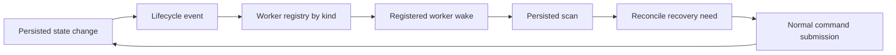

# Recovery Lifecycle Worker Architecture

## Summary

State transitions publish lifecycle events. Recovery behavior is owned by registered workers.

The producer of a persisted workflow or task state change is responsible for publishing a lifecycle wakeup after the durable state change is recorded. The producer must not directly auto-fix, recreate, or launch external recovery scripts as part of handling a failed delta. Auto-fix, requeue, and external recovery are worker responsibilities. Workers are discovered through the worker registry and must act through the same normal command routes used by operators.

This note describes the runtime contract.

Worker-status and other main-process poll paths must stay bounded — see
[Main-Process Read Hot Paths](./main-process-read-hot-paths.md).

## Resolved Overlap (Worker Registry)

Earlier, auto-fix ran from more than one place: a producer could schedule auto-fix directly from failure handling, and a separate worker loop could also act on the same failed state. Two engines could observe the same failure and compete over what recovery meant.

That overlap is now resolved by the worker registry. `createWorkerRegistry` owns lookup and registration by stable worker `kind`; `registerBuiltinWorkers` installs built-in definitions in a stable order; app startup layers operator-declared external workers on top with `registerExternalWorkersFromConfig`.

These properties define the registered model:

- **Built-in default auto-fix.** The built-in auto-fix worker is registered as kind `autofix`; its underlying runtime reports recovery ownership as `recovery` and submits normal `fix-with-agent` recovery intents.
- **Scan on start.** Starting the auto-fix worker runs a full scan immediately (`tickOnStart`), so tasks that are already failed are reconciled when the worker comes up, not one poll interval later.
- **Manual one-shot scan.** `./run.sh --headless worker autofix` drives the same registered auto-fix worker for an explicit operator scan.
- **External extension point.** `externalWorkers` config entries add more registry kinds without changing producer code; each entry supplies a supervised process launch boundary.

A **sweep-and-assert guard** pattern fails the build if a recovery channel is triggered from any code path outside its registered worker engine and sanctioned command/dispatcher routes. This locks the single-owner invariant in against future drift, so a new direct auto-fix or requeue call cannot reintroduce a second recovery path.

## Achieved Model

Lifecycle events are ephemeral wakeups, not durable truth. Persisted workflow and task state remains authoritative.



The achieved model separates responsibilities:

| Responsibility | Owner | Contract |
| --- | --- | --- |
| Persist state transition | Producer | Write the authoritative workflow or task state first. |
| Publish lifecycle wakeup | Producer | Emit an event after the persisted transition so subscribers can re-check state. |
| Decide recovery action | Registered worker | Read persisted state and reconcile whether work is still needed. |
| Execute recovery | Registered worker through command route | Submit normal commands rather than mutating recovery state directly. |

Producers must not directly auto-fix, recreate, requeue, or launch external recovery scripts. They publish lifecycle events and leave recovery decisions to registered workers.

## Durable State Authority

The message bus is not the source of truth. Lifecycle events may be missed, duplicated, delayed, or observed by multiple subscribers. Workers must treat events as prompts to inspect durable state.

Required behavior:

1. Persisted workflow and task state determines whether recovery is needed.
2. Lifecycle events only wake subscribers so they can scan persisted state.
3. Workers must be idempotent against repeated wakeups.
4. Workers must tolerate missed events by relying on periodic or startup scans where needed.
5. Recovery commands must re-check current state through existing command handling before making changes.

This preserves the existing persistence model while allowing the recovery system to become event-driven.

## Worker Registry

The worker registry is a generic catalog of `WorkerDefinition` entries keyed by stable `kind`. A definition has a human-readable note and a factory that builds a `WorkerRuntime` from injected owner dependencies. The registry itself is worker-agnostic: built-in worker wiring lives beside each worker implementation, and app/headless entry points compose the registry they need.

Registered worker kinds are the operator-facing control surface:

- `worker list` prints registered kinds and notes.
- Desktop and owner status snapshots render rows from `registry.list()`.
- `start(kind)` and `stop(kind)` require `registry.get(kind)`, so unknown kinds fail before any runtime is created.
- Manual headless scans acquire `worker-<kind>.lock`, making the single-instance lock per kind rather than global.

The built-in set includes `autofix` as the default recovery worker for failed-task fixes. Operator-declared `externalWorkers` append additional kinds by config, so external automation is selected through the same registry and lifecycle controls as built-ins.

## Worker Wakeups

A lifecycle event should carry enough context to make wakeups efficient, such as workflow ID, task ID, transition type, and generation where available. That context is an optimization, not authority.

On wake, a worker should:

1. Load the current persisted workflow and task state.
2. Ignore stale wakeups that no longer match the persisted generation or status.
3. Decide whether its specific recovery responsibility applies.
4. Submit a normal command when recovery is still needed.
5. Record any worker-owned bookkeeping through normal persistence paths.

Registered workers may subscribe to the same lifecycle event stream. Contention is controlled by persisted state checks and command-route validation, not by assuming one subscriber receives a unique event.

## Auto-Fix Worker

Automatic fix attempts are owned by the built-in auto-fix worker registered as kind `autofix` in `@invoker/execution-engine`. The worker's underlying runtime identity remains `recovery` for existing recovery audit events. It subscribes to lifecycle wakeups, scans persisted state, keys consumed attempts in worker runtime memory by task lineage, and decides whether an auto-fix command should be submitted. `./run.sh --headless worker autofix` is only a manual one-shot scan through the same registered definition.

Lifetime and concurrency are constrained so the registered worker stays single for each explicit start path:

- The worker is **process-owned**: it lives and dies with the owner process or headless command that started it.
- A **single-instance lock per kind** refuses a second concurrent explicit worker start for the same registered kind, so `autofix` manual scans cannot race another explicit `autofix` door while unrelated worker kinds remain independently controllable.

The engine should only act when persisted state shows that:

1. The workflow or task is in a state eligible for auto-fix.
2. No newer generation has superseded the failed state.
3. `autoFixRetries` leaves in-memory retry budget for the task lineage; `0` disables auto-fix and a finite value such as `3` permits at most three submitted attempts until the worker restarts or the task lineage changes.
4. No incompatible recovery action is already in progress.

When those checks pass, the auto-fix worker submits the normal fix command. It must not be invoked directly by the producer that recorded the failed transition. The sweep-and-assert guard fails the build if any auto-fix is triggered outside this shared worker engine and its sanctioned operator command route.

## Requeue Worker (liveness stalls)

Not every failure is a defect the AI should fix. The executing-stall watchdog
force-fails a task whose executor stopped heartbeating with `Execution stalled:
... (attempt lease expired)`. That is a liveness/infrastructure timeout — the
task's work was never proven broken — so handing it to the auto-fix worker just
re-runs the same step, re-stalls, and loops.

Such failures are tagged with a structured `execution.failureClass` of
`liveness_stall` when the stall guard records them. Two rules follow:

- **Auto-fix skips liveness failures.** The auto-fix worker's eligibility check
  returns false for a `liveness_stall`, the same way it already skips
  user-cancelled failures.
- **The requeue worker owns them.** A dedicated subscriber worker wakes on
  lifecycle events, scans persisted state for `failed` + `liveness_stall` tasks,
  and submits the normal `retry-task` command (a requeue — re-run the same work,
  not an AI fix).

The requeue worker is bounded, so it cannot become a different infinite loop:

1. A runtime-local ledger keyed by task **lineage** (`taskId` + `generation`,
   which `retryTask` preserves) caps requeues at `stallRequeueRetries`
   (default 3).
2. A backoff of `stallRequeueBackoffMs` (default 2 minutes) spaces requeues so a
   task is not instantly re-run into the same stall while the machine is still
   overloaded.
3. Once the budget is exhausted the worker submits an escalation command that
   parks the task in `needs_input` with an operator-facing reason, exactly once.

`failureClass` is cleared on every retry/recreate reset, so a requeued run that
later fails for a real reason is classified fresh and routed to auto-fix
normally. As with auto-fix, a sweep-and-assert guard fails the build if the
requeue channel is referenced outside the requeue worker engine and its
dispatcher registration.

Complementary hardening: the merge-gate publish paths (`executeMergeNode` and
`publishAfterFix`) pump the attempt heartbeat/lease while the make-pr publisher
runs, so a slow-but-alive publish is not misclassified as a stall in the first
place.

## Operator Status

Operators can inspect recovery ownership and recent decisions with:

```bash
./run.sh --headless worker status --output text
./run.sh --headless worker status --output json
```

The status view is audit-backed and read-only. It reports the recovery worker id, owner, last wakeup, last scan, last submitted recovery command, and the latest skip reason. Status reporting must not change recovery eligibility or command submission ordering.

## Worker Decision Ledger

Every worker that owns act/skip decisions records them into the durable
`worker_actions` table through the shared `recordWorkerDecisionRow` helper in
`@invoker/execution-engine`. This gives operators one queryable, cross-worker
history of what each worker decided — which tasks the auto-fix worker submitted
for fixing, and which it deliberately skipped and why — instead of
reconstructing it from scattered per-task debug events.

Recording policy:

- **Act** decisions (submit / complete / fail) are always recorded.
- **Meaningful skips** (retry budget exhausted or disabled, not eligible, run
  failure) are recorded with `status: 'skipped'` and a `reason`.
- **Routine scan noise** (stale snapshots, dedupe hits, lock contention,
  vanished tasks) is logged as a per-task debug event only and never creates a
  durable row. `isMeaningfulSkipReason` classifies the reason.

Rows are latest-state-per-lineage: repeated decisions on the same task lineage
(`autofix:<taskId>:<generation>:<attemptId>` for auto-fix) update a single row,
with `attemptCount` and timestamps carrying the history.

Query decisions read-only:

```bash
./run.sh --headless query worker-decisions --workflow <id> --output json
./run.sh --headless query worker-decisions --decision skip --reason budget
```

The desktop Workers tab surfaces the same feed: selecting a worker shows a
`Decisions` list (act vs skip, with reasons) backed by the
`invoker:get-worker-decisions` IPC channel.

Only the auto-fix and CI-failure workers own per-task decisions. The
PR-maintenance crons record coarse run-level rows (running → completed/failed);
the pr-status worker delegates its decisions to the review gate, and the
disk-headroom and external-process workers have no task/workflow decision to
record.

## External Workers

External worker support is configuration-driven. Each `externalWorkers` entry declares a stable registry `kind` plus a `launch` object with `executable`, optional `args`, and optional `cwd`. The app loader calls `registerExternalWorkersFromConfig`, which registers each configured kind with a note of the form `Supervises external worker process <executable>`.

The supervised external-process boundary is deliberately narrow:

1. Starting or waking the worker launches the configured executable if no child process is already tracked.
2. The child inherits stdout and stderr, while stdin is ignored.
3. `stop()` sends `SIGTERM` and escalates to `SIGKILL` after the stop timeout if the child is still alive.
4. The runtime reports running only while the registered worker has started, has not stopped, and still owns a live child process.

External worker processes are therefore coordinated by the same registry, start/stop controls, and per-kind lock discipline as built-ins. State-transition producers still must not launch scripts directly; they publish lifecycle wakeups, and any external worker process is started by the registered external worker runtime after operator configuration selects that kind.

## Guarded Boundaries

Direct recovery handlers are intentionally outside the design. Failed-delta handlers publish lifecycle wakeups only; workers own action/skip decisions after reading durable state.

The generalized guard model preserves these invariants:

1. State changes are persisted before lifecycle events are published.
2. Lifecycle events are wakeups and may be replayed or missed.
3. Persisted state remains authoritative for all recovery decisions.
4. Recovery workers submit normal commands instead of bypassing command handling.
5. Producers do not directly auto-fix, recreate, requeue, or launch external recovery scripts.
6. Source-sweep guards fail when a recovery trigger appears outside the registered worker engine and its allowlisted command or dispatcher route.

This makes the registry plus external-worker model the canonical recovery design: producers publish durable transitions and wakeups; registered workers reconcile state; command routes perform the mutation.
