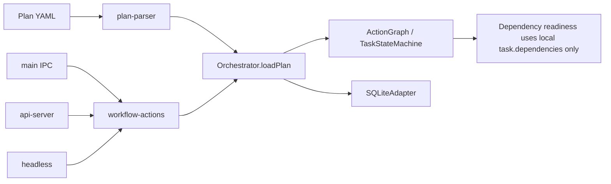
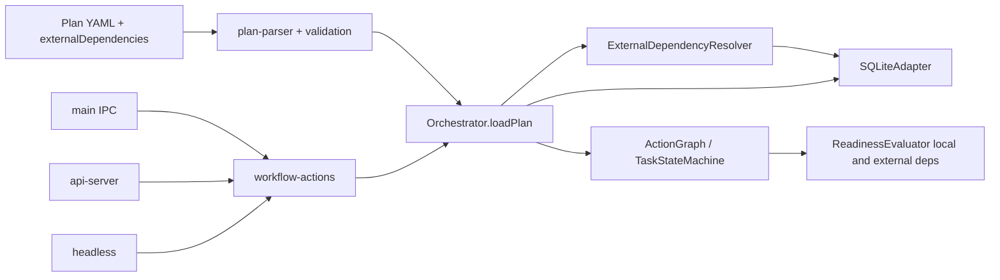

# Cross-Workflow Gate Architecture (Before -> After)

## Summary
Implement native cross-workflow gate dependencies so plans no longer need `sqlite3` command tasks.
- Reference model: explicit IDs (`workflowId` + `taskId`).
- Submission policy: reject if prerequisite task does not exist.
- Runtime policy: if prerequisite exists but is not `completed`, dependent tasks remain pending/blocked until it completes.

## Before Architecture

Current code path anchors:
- Plan parsing has only local `dependencies` on tasks: `packages/app/src/plan-parser.ts`
- Workflow materialization/scoped deps in orchestrator: `packages/core/src/orchestrator.ts`
- Readiness check is local graph-only deps: `packages/core/src/state-machine.ts`
- Graph ready-node logic only inspects local node IDs: `packages/graph/src/action-graph.ts`
- UI/API/CLI mutate through shared app actions today: `packages/app/src/workflow-actions.ts`

## After Architecture

Behavior:
1. `loadPlan` validates every external reference exists in DB.
2. If missing, plan submission is rejected with explicit missing refs.
3. If present-but-incomplete, task is created but not runnable; UI/API show blocked reason.
4. When referenced external task becomes `completed`, dependent task becomes ready and schedules.

## Code Contribution Map

### Types and schema
- Extend plan task model with `externalDependencies`.
- Extend runtime task metadata to carry resolved external gate status/reason.
- Files:
  - `packages/graph/src/types.ts`
  - `packages/app/src/plan-parser.ts`

### Validation and submission gate
- Add parser-level shape validation for `externalDependencies`.
- Add orchestrator load-time existence validation against persistence.
- Files:
  - `packages/app/src/plan-parser.ts`
  - `packages/core/src/orchestrator.ts`

### Readiness engine
- Add external dependency check into readiness evaluation (`pending`/`blocked` until satisfied).
- Re-evaluate waiting tasks after completion events in any workflow.
- Files:
  - `packages/core/src/state-machine.ts`
  - `packages/graph/src/action-graph.ts`
  - `packages/core/src/orchestrator.ts`

### Persistence/query support
- Add lightweight persistence queries to resolve external refs and status.
- Keep existing workflow/task tables; avoid new table in v1 unless needed.
- Files:
  - `packages/persistence/src/sqlite-adapter.ts`
  - `packages/persistence/src/adapter.ts`

### Surface visibility
- Expose blocked reason/source to UI/API responses so operators can see exact gate.
- Files:
  - `packages/app/src/api-server.ts`
  - `packages/ui/src/hooks/useTasks.ts`
  - `packages/ui/src/components/TaskPanel.tsx`

## Public Interface Changes
- Plan task field addition:
  - `externalDependencies: [{ workflowId: string, taskId: string, requiredStatus: "completed" }]`
- No breaking change to existing `dependencies`; both can coexist.
- Submission error contract includes missing external refs list.

## Test Plan
- Parser/orchestrator validation rejects missing external refs at submission.
- Runtime keeps dependent tasks non-runnable while external ref is incomplete.
- Completing external prerequisite unblocks downstream task scheduling.
- Restart/sync preserves blocked state and later unblocks correctly.
- UI/API show deterministic blocked reason for cross-workflow gates.

## Assumptions
- v1 supports only `requiredStatus = completed`.
- Explicit IDs are authoritative; no name-based resolution in v1.
- Missing prerequisite blocks submission; existing-but-incomplete does not.
