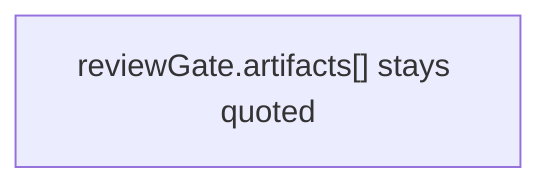
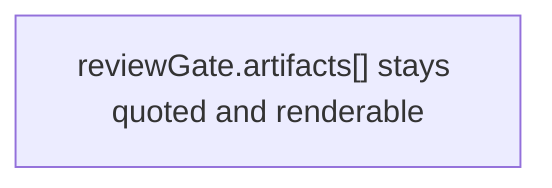

## Summary

Tighten Mermaid validation.

## Review Claim

Quoted Mermaid labels with code-ish text still pass local PR-body validation.

## Review Lane

- policy

## Review Unit

- tooling-policy

## Safety Invariant

Only the local PR-body guardrail changes.

## Slice Rationale

The validator hardening lands separately from other PR workflow edits.

## Non-goals

- Do not change runtime review-gate behavior.

## Architecture

### Before

### After

## Test Plan

Test Plan

- [ ] `node scripts/validate-pr-body.mjs --body-file scripts/fixtures/pr-body-mermaid-reviewgate-quoted.md`

## Revert Plan

Revert Plan

- Safe to revert? Yes
- Revert command: `git revert <sha>`
- Post-revert steps: None
- Data migration? No

