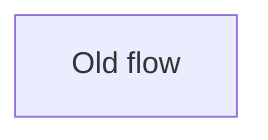

## Summary

Describe what changed and why in plain English.

Write paragraphs, not bullets. Keep each paragraph under 30 words.

Put one idea in each paragraph. If one idea leads to another, split them into separate short paragraphs.

## Architecture

Only keep this section if the change affects component interactions, control flow, or data flow.

### Before

### After

## Test Plan

- [ ] `exact command`
- [ ] `exact command`

## Visual Proof

Required when the diff changes UI-impacting files. Include before/after screenshots or a video link.

## Revert Plan

- Safe to revert? Yes/No
- Revert command: `git revert <sha>`
- Post-revert steps: None
- Data migration? No
