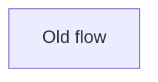
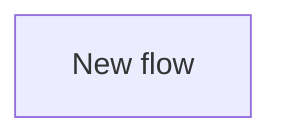

## Summary

Describe what changed and why in plain English.

Write paragraphs, not bullets. Keep each paragraph under 30 words.

Put one idea in each paragraph. If one idea leads to another, split them into separate short paragraphs.

Review metadata

Review Claim: State the one thing the reviewer is being asked to approve.

Review Lane: Choose exactly one: `behavior`, `refactor`, `proof`, `cleanup`, `policy`, or `docs`.

Review Unit: Choose the matching review unit, such as `tooling-policy`, `routing`, or `docs`.

Safety Invariant: Explain why this slice is safe to review locally.

Slice Rationale: Explain why this work is split here instead of bundled elsewhere.

## Non-goals

List what this slice explicitly does not change.

## Architecture

Only keep this section if the change affects component interactions, control flow, or data flow.
Quote Mermaid labels when they contain prose, punctuation, or code-ish text like `reviewGate.artifacts[]`.

### Before

### After

## Test Plan

- [ ] `exact command`
- [ ] `exact command`

## Visual Proof

Required when the diff changes UI-impacting files. Include before/after screenshots or a video link.

## Revert Plan

- Safe to revert? Yes/No
- Revert command: `git revert <sha>`
- Post-revert steps: None
- Data migration? No
