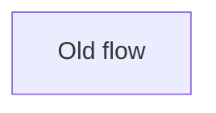
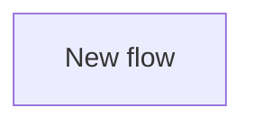

## Summary

Describe what changed and why. Keep this concrete and outcome-focused.

## Architecture

Only keep this section if the change affects component interactions, control flow, or data flow.

### Before

### After

## Test Plan

- [ ] `exact command`
- [ ] `exact command`

## Revert Plan

- Safe to revert? Yes/No
- Revert command: `git revert <sha>`
- Post-revert steps: None
- Data migration? No
