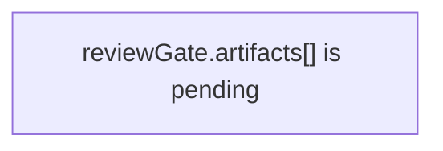

# make-pr

Use this skill when the work is already done and the user wants a PR created, updated, or rewritten.

For stacked PRs, apply `skills/review-compression/SKILL.md` before you write titles or PR bodies. If one branch mixes more than one local review claim, split the stack first.
For decomposition or extraction refactors (splitting a large file into modules), one PR moves one cohesive unit: create the target file, move ONE function/class/phase, re-point references, keep the public surface stable. The next unit is the next PR. Bundling several extractions into one branch ("extract prepare + dispatch + finalize") is the default mistake this rule prevents — see the **Decomposition & Extraction Refactors** section of `skills/review-compression/SKILL.md`.

## Stack ordering

Order slices so a reviewer reads the evidence before the change it justifies (see `skills/review-compression/SKILL.md` → Ordering Rules):

- **Repro/proof comes before the fix.** Land the repro or regression proof as the earlier slice (e.g. `(1)`) and the behavior fix as the later slice (e.g. `(2)`), so the bug is demonstrated before the change is approved.
- Keep each slice green for CI: write the proof to assert the current (buggy) behavior, or mark the unfixed expectation pending (`it.fails` / skip with a TODO); the fix slice then flips it to the corrected behavior.
- Foundation (types, helpers, migrations, flags) precedes behavior; cleanup and docs come last.

## What this skill covers

- PR title/body authoring for Invoker
- The preferred PR section schema
- Upstream-first branch/PR workflow (explicit base and publish remotes)
- Repo-specific publication rules:
  - Invoker-on-Invoker stacks may use `mergify stack push`
  - unrelated target repos should keep their own normal PR workflow unless they independently use Mergify Stacks

## Preferred PR schema

Default to this structure:

```md
## Summary

Plain-English explanation of what changed and why.

Write this for a burnt out developer who needs the point quickly.

Use paragraphs, not bullets. Keep each paragraph under 30 words.

Put one idea in each paragraph. If one idea leads to another, split them into separate short paragraphs.

Avoid implementation jargon unless it is necessary for understanding the change.

## Review Claim

State the one thing the reviewer is being asked to approve.

## Review Lane

Choose exactly one: `behavior`, `refactor`, `proof`, `cleanup`, `policy`, or `docs`.

## Safety Invariant

Explain why this slice is safe to review locally.

## Slice Rationale

Explain why this work is split here instead of bundled elsewhere.

## Non-goals

List what this slice explicitly does not change.

## Architecture

Only include this section when the change modifies component interactions, control flow, state flow, or data flow.

Quote Mermaid labels when they contain prose, punctuation, or code-ish text. Safe:



Unsafe:

```mermaid
graph TD
    A[reviewGate.artifacts[] is pending]
```

## Test Plan

- [ ] exact command
- [ ] exact command

## Visual Proof

Required when the diff changes UI-impacting files. Include before/after screenshots or a video link.

## Revert Plan

- Safe to revert? Yes/No
- Revert command: `git revert <sha>` or equivalent
- Post-revert steps: None / concrete steps
- Data migration? No / concrete steps
```

If the change is small and has no architectural impact, omit `## Architecture` rather than forcing filler.

If the change is UI-impacting, use `skills/visual-proof/SKILL.md` first and include its screenshot/video markdown in `## Visual Proof`. UI-impacting means the user-visible experience changes, even when no file under `packages/ui/**` changes. This includes `packages/ui/**`, Electron window lifecycle files, preload, main process window wiring, app menu changes, task status changes, task error or output text shown in panels, approval/reject behavior, workflow state shown in the DAG or inspector, and web-surface output.

Do not default to a lightweight `## Summary / ## Testing / ## Notes` PR body. That shape is ad hoc drift, not the repo standard. Use `## Summary / ## Review Claim / ## Review Lane / ## Safety Invariant / ## Slice Rationale / ## Non-goals / ## Test Plan / ## Revert Plan` as the floor, add `## Visual Proof` for UI-impacting diffs, and add `## Architecture` when the change affects component interactions or data/control flow.

## Command surface

Preferred repo-local flow:

1. Make sure the branch is based from the canonical base remote.
   Reference: `docs/pr-branching-workflow.md`
2. Push the working branch to the configured publish remote (typically `origin`).
3. Start from the canonical template and validate it:

```bash
cp scripts/pr-body-template.md /tmp/my-pr.md
$EDITOR /tmp/my-pr.md
node scripts/validate-pr-body.mjs --body-file /tmp/my-pr.md
```

4. Create or update the PR with:

```bash
node scripts/create-pr.mjs --title "<title>" --base master --body-file /tmp/my-pr.md
```

Update an existing PR with:

```bash
node scripts/create-pr.mjs --title "<title>" --base master --body-file /tmp/my-pr.md --update <pr-number>
```

For Mergify-managed stack PRs, this update path is REQUIRED after `mergify stack push`. Do not use `gh pr edit` for stack PR body/title updates, because it bypasses the changed-file scope checks in `create-pr.mjs`.

This script handles local image path upload/injection when configured. It also rejects UI-impacting diffs unless the body includes visual proof media.

## Upstream-first workflow

Use the canonical repository as the PR target and an explicit publish remote (typically `origin`) for branch publication.

- Do not depend on fork-sync scripts before PR creation.
- Create branches from `<baseRemote>/<base>` (for example `origin/master` when `origin` is the canonical clone remote).
- Push branches to the chosen publish remote.
- Open PRs against the canonical repository base branch.

Reference:

- `docs/pr-branching-workflow.md`

## Invoker-specific publication rule

If the target repo is Invoker itself (`EdbertChan/Invoker` or `Neko-Catpital-Labs/Invoker`):

- use the preferred PR schema above
- keep stack publication explicit
- Invoker-on-Invoker review stacks should publish through the repo-local make-pr workflow, then use:

```bash
mergify stack push
```

Do not generalize this to unrelated repos.

## Stack repair after review

If review says one published stack slice is still too broad:

1. Re-run `skills/review-compression/SKILL.md`.
2. If one published slice must split, keep the shared idea and create lettered replacement titles such as `(4a)` and `(4b)`.
3. Run `mergify stack push`.
4. Switch to each generated stack branch.
5. Get the real base branch with `gh pr view --json baseRefName --jq .baseRefName`.
6. Update each PR with `node scripts/create-pr.mjs --title "..." --base <actual-base-branch> --body-file <file> --update-existing`.

Manual `gh pr edit` is a last-resort escape hatch only when `create-pr` itself is broken. The normal path is `create-pr --update-existing`.


## Validation

- **Never publish an empty slice.** Do not create, update, or stack-push a PR when the branch has no file changes versus its base, or when any commit in the `base..HEAD` range is an empty commit (no file changes from its parent). This applies to normal `create-pr`, the `--update-existing` path, and Mergify stack publication (`mergify stack push`). Drop or fold the empty commit first; `create-pr.mjs` enforces this and will refuse before any push or GitHub API call.
- ensure the branch is pushed
- ensure the body sections are present and concrete
- ensure test commands are real commands that were actually run when possible
- ensure revert guidance is honest
- validate the body with `node scripts/validate-pr-body.mjs --body-file <file>`
- for stacked PRs, update title/body through `node scripts/create-pr.mjs --update-existing ...`, not `gh pr edit`
- for UI-impacting diffs, include `## Visual Proof` with screenshot or video proof before `node scripts/create-pr.mjs`; classify by user-visible behavior, not by path alone

If you include `## Architecture`, keep the diagrams renderable by GitHub Mermaid.
Always quote labels that contain prose, punctuation, or code-ish text such as `reviewGate.artifacts[]`.
Reference:

- `scripts/test-pr-diagrams.sh`

## References

- `docs/pr-branching-workflow.md`
- `scripts/create-pr.mjs`
- `scripts/pr-body-template.md`
- `scripts/validate-pr-body.mjs`
- `scripts/test-pr-diagrams.sh`
