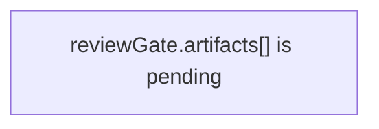

# make-pr

Use this skill when the work is already done and the user wants a PR created, updated, rewritten, split, or republished.

Read this skill and `skills/visual-proof/SKILL.md` from the PR's target base branch (for example `git show origin/master:skills/make-pr/SKILL.md`) before authoring proof or PR bodies. Working branches and merge clones can carry stale policy copies, and the validators enforce the base branch's rules.

For stacked PRs, apply `skills/review-compression/SKILL.md` before you write titles or PR bodies. If one branch mixes more than one local review claim, split the stack first.
For decomposition or extraction refactors (splitting a large file into modules), do one refactor at a time: one PR moves exactly ONE top-level symbol. A function move is its own PR; a class moves as one PR with its methods (one top-level symbol, not method-by-method). Create the target file, move that one symbol, re-point references in the same PR, and keep the public surface stable. The next symbol is the next PR. If the symbol depends on a private helper that is not exported, move that minimal helper cluster with it only when splitting them would break the build or force a throwaway shim. Bundling several extractions into one branch ("extract prepare + dispatch + finalize") is the default mistake this rule prevents — see the **Decomposition & Extraction Refactors** section of `skills/review-compression/SKILL.md`.

## Stack ordering

Order slices so a reviewer reads the evidence before the change it justifies (see `skills/review-compression/SKILL.md` → Ordering Rules):

- **Repro/proof comes before the fix.** Land the repro or regression proof as the earlier slice (e.g. `(1)`) and the behavior fix as the later slice (e.g. `(2)`), so the bug is demonstrated before the change is approved.
- Keep each slice green for CI: write the proof to assert the current (buggy) behavior, or mark the unfixed expectation pending (`it.fails` / skip with a TODO); the fix slice then flips it to the corrected behavior.
- Foundation (types, helpers, migrations, flags) precedes behavior; cleanup and docs come last.

## What this skill covers

- PR title/body authoring for Invoker
- The preferred PR section schema
- Upstream-first branch/PR workflow (explicit base and publish remotes)
- Repo-specific publication rules:
  - Invoker-on-Invoker stacks may use `mergify stack push`
  - unrelated target repos should keep their own normal PR workflow unless they independently use Mergify Stacks


- For published Mergify stacks, maintain one machine-managed stack comment on every PR in the stack. The comment lists the full stack bottom-to-top and must be refreshed whenever the stack changes.
## Preferred PR schema

Default to this structure:

```md
## Summary

Plain-English explanation of what changed and why.

Write this for a burnt out developer who needs the point quickly.

Use paragraphs, not bullets. Keep each paragraph under 30 words.

Put one idea in each paragraph. If one idea leads to another, split them into separate short paragraphs.

Avoid implementation jargon unless it is necessary for understanding the change.

## Review Claim

State the one thing the reviewer is being asked to approve.

## Review Lane

Choose exactly one: `behavior`, `refactor`, `proof`, `cleanup`, `policy`, or `docs`.

## Review Unit

Choose the matching review unit, such as `tooling-policy`, `routing`, or `docs`.

## Safety Invariant

Explain why this slice is safe to review locally.

## Slice Rationale

Explain why this work is split here instead of bundled elsewhere.

## Non-goals

List what this slice explicitly does not change.

## Architecture

Only include this section when the change modifies component interactions, control flow, state flow, or data flow.

Quote Mermaid labels when they contain prose, punctuation, or code-ish text. Safe:



Unsafe:

```mermaid
graph TD
    A[reviewGate.artifacts[] is pending]
```

## Test Plan

<details>
<summary>Test Plan</summary>

- [ ] exact command
- [ ] exact command

</details>

## Visual Proof

Required when the diff changes UI-impacting files. Include before/after screenshots or a video link.

## Revert Plan

<details>
<summary>Revert Plan</summary>

- Safe to revert? Yes/No
- Revert command: `git revert <sha>` or equivalent
- Post-revert steps: None / concrete steps
- Data migration? No / concrete steps

</details>
```

If the change is small and has no architectural impact, omit `## Architecture` rather than forcing filler.

If the change is UI-impacting, use `skills/visual-proof/SKILL.md` first and include its screenshot/video markdown in `## Visual Proof`. UI-impacting means the user-visible experience changes, even when no file under `packages/ui/**` changes. This includes `packages/ui/**`, Electron window lifecycle files, preload, main process window wiring, app menu changes, task status changes, task error or output text shown in panels, approval/reject behavior, workflow state shown in the DAG or inspector, and web-surface output.

Use visible markdown sections for review metadata. Do not hide `Review Claim`, `Review Lane`, `Review Unit`, `Safety Invariant`, or `Slice Rationale` inside `<details>` or other HTML disclosure blocks. Review metadata must render directly in the PR body.

Test Plan and Revert Plan are the opposite: keep their `## Test Plan` / `## Revert Plan` headings visible, but their content must sit inside a collapsed `<details>` block with `<summary>Test Plan</summary>` / `<summary>Revert Plan</summary>`. `scripts/validate-pr-body.mjs` rejects a plan section whose content is not collapsed, and rejects the `open` attribute.

When an existing PR changes after its body or proof was written, rerun this skill from the current diff before updating the PR. If the new diff touches UI-impacting files, rerun `skills/visual-proof/SKILL.md` and replace old screenshot or video links with fresh proof for the current code. Do not reuse earlier proof media after UI behavior changes.
Visual proof must show the changed behavior itself, not just the changed screen area. Before creating or updating the PR, open every screenshot or video and verify the user-visible target is present and identifiable. For conditional or event-driven UI, drive the exact condition that triggers the new state and capture that state. A generic task panel, unchanged sidebar, unrelated graph, or stale screenshot is not proof, even when the right file changed.

If the changed behavior spans multiple states or a state transition — for example restart persistence, before/after workflow transitions, progress animations, opening then dismissing overlays, or any proof labeled “before” and “after” — use animated proof. A gif, mp4, webm, or walkthrough video is required; static screenshots alone are not enough.

When the claim is that a state persists across an action — navigation, restart, refresh, resize — each screenshot must also show the action happened. Number the frames as a sequence and make every frame identify its step through an on-screen cue: the moved selection highlight, the changed route, or the swapped panel, with the preserved state unchanged beside it. Two frames that differ only in the preserved state do not prove the action occurred; if no on-screen cue distinguishes the steps, rely on the walkthrough video as the primary proof.

In the PR body, caption each visual proof item with the concrete thing the reviewer should see, for example "amber Workspace recreated notice in the task inspector." If the reviewer cannot tell what changed from the image and caption, recapture proof before publishing.

Before/after visual proof images must use distinct local filenames before `node scripts/create-pr.mjs` uploads them. The uploader keys media by basename inside one upload prefix, so `before/foo.png` and `after/foo.png` can collapse to one final URL. Copy or rename the files first, for example `/tmp/proof/foo-before.png` and `/tmp/proof/foo-after.png`, then put those unique paths in the PR body.

The final published PR body must not leave repo-relative proof paths in markdown. Use `node scripts/create-pr.mjs` so local proof files are uploaded or rewritten to published URLs before the PR is created or updated.

If the changed behavior is a cursor, pointer, hover-only affordance, or other state that a static screenshot cannot show, do not present an unchanged screenshot as proof of the behavior. Add a short video, an inspectable state proof, or a focused test reference, and say plainly why the screenshot alone cannot show it.

When a PR changes skill instructions under `skills/**/SKILL.md`, add or update a focused skill contract test for the exact issue being fixed. The test must fail if the instruction that prevents the regression is removed.

Do not default to a lightweight `## Summary / ## Testing / ## Notes` PR body. That shape is ad hoc drift, not the repo standard. Use `## Summary / ## Review Claim / ## Review Lane / ## Review Unit / ## Safety Invariant / ## Slice Rationale / ## Non-goals / ## Test Plan / ## Revert Plan` as the floor, keep Test Plan and Revert Plan content in their collapsed `<details>` blocks, add `## Visual Proof` for UI-impacting diffs, and add `## Architecture` when the change affects component interactions or data/control flow.

## Diff atomicity gate

`scripts/create-pr.mjs` computes changed files and a full-context diff, then runs `scripts/lint-pr-diff-atomicity.mjs` through the PR body checker before image upload, push, or GitHub mutation.

For Invoker stacked PRs, diff atomicity blockers are hard failures. Readability warnings like large file count stay warnings, but a stack slice that trips a diff-atomicity finding such as unrelated areas MUST be split before publication.

If one branch mixes behavior, refactor, cleanup, or test-harness/proof work, split the work into separate PRs. Do not relabel the lane or weaken the checker to make a mixed branch pass.

## Command surface

Preferred repo-local flow:

1. Make sure the branch is based from the canonical base remote.
   Reference: `docs/pr-branching-workflow.md`
2. Push the working branch to the configured publish remote (typically `origin`).
3. Start from the canonical template and validate it:

```bash
cp scripts/pr-body-template.md /tmp/my-pr.md
$EDITOR /tmp/my-pr.md
node scripts/validate-pr-body.mjs --body-file /tmp/my-pr.md
```

4. Create or update the PR with:

```bash
node scripts/create-pr.mjs --title "<title>" --base master --body-file /tmp/my-pr.md
```

Update an existing PR with:

```bash
node scripts/create-pr.mjs --title "<title>" --base master --body-file /tmp/my-pr.md --update <pr-number>
```

For stacked PRs, `create-pr` also refreshes the machine-managed full-stack comment across every PR in the connected stack. The comment marks the target PR with `← this PR`.

For Mergify-managed stack PRs, this update path is REQUIRED after `mergify stack push`. Do not leave the Mergify-generated placeholder title/body live.
After `mergify stack push`, you MUST audit the live PRs immediately. Default Mergify-created titles/bodies like an empty description or a bare `Depends-On:` line are a publication failure, not a follow-up chore.

Required post-push audit:
No custom payload parsing is required here. The check is simple: verify the rendered title/body and the base/head branch names on each live PR.

1. Read each live PR (`gh pr view` or `pr://`) for title, body, base, and head.
2. If any PR is missing the preferred body sections or the aligned stack title prefix, repair it before yielding.
3. Prefer `node scripts/create-pr.mjs --update-existing ...` when the current local branch matches the published PR branch.
4. If Mergify generated a remote-only head branch name that `create-pr` cannot map from the local branch, use `gh pr edit --title ... --body-file ...` immediately rather than leaving placeholder metadata live.

Do not stop after `mergify stack push` until the GitHub-side metadata matches the intended titles and bodies.

This script handles local image path upload/injection when configured. It also rejects UI-impacting diffs unless the body includes visual proof media.

## Upstream-first workflow

Use the canonical repository as the PR target and an explicit publish remote (typically `origin`) for branch publication.

- Do not depend on fork-sync scripts before PR creation.
- Create branches from `<baseRemote>/<base>` (for example `origin/master` when `origin` is the canonical clone remote).
- Push branches to the chosen publish remote.
- Open PRs against the canonical repository base branch.

Reference:

- `docs/pr-branching-workflow.md`

## Invoker-specific publication rule

If the target repo is Invoker itself (`EdbertChan/Invoker` or `Neko-Catpital-Labs/Invoker`):

- use the preferred PR schema above
- keep stack publication explicit
- Invoker-on-Invoker review stacks should publish through the repo-local make-pr workflow, then use:

```bash
mergify stack push
```

Do not generalize this to unrelated repos.

### Run `mergify stack push` only from the working branch

Never run `mergify stack push` (including the `-k` update variant) while checked out on a Mergify-generated stack branch (`stack/<user>/<working-branch>/<slug>--<change-id>`). The real push does not fail safe there: instead of refusing, it can auto-switch to a stale leftover branch and publish an unrelated stack. This happened once — PR #3407 published accidental PRs #3408–#3411 from a leftover `tmp-rebase-fixsessions` branch.

- Push only from the working branch (for example `pr/<name>`), where the stack resolves as `<trunk>..HEAD`.
- Always preview with `mergify stack push --dry-run` first and confirm the plan pushes ONLY your intended commits. `--dry-run` refuses on a generated branch; the real push does not, so the dry-run is your safety check.
- To update ONE already-published branch, prefer `git push --force-with-lease origin HEAD` — it is deterministic and does no stack resolution.
- Use the guard `node scripts/safe-stack-push.mjs` (add `--execute` to push). It refuses on a generated branch and forces the dry-run preview before any real push.

## Stack repair after review

If review says one published stack slice is still too broad:

1. Re-run `skills/review-compression/SKILL.md`.
2. If one published slice must split, keep the shared idea and create lettered replacement titles such as `(4a)` and `(4b)`.
3. If the split creates a conflict-only, import-only, or other no-new-claim fixup slice, fold that fixup into the previous slice before publication.
4. Re-audit every rebuilt slice in the resulting stack, not just the PR that was flagged.
5. Run `mergify stack push`.
6. Switch to each generated stack branch.
7. Get the real base branch with `gh pr view --json baseRefName --jq .baseRefName`.
8. Update each PR with `node scripts/create-pr.mjs --title "..." --base <actual-base-branch> --body-file <file> --update-existing`.
9. After any stack reorder, replacement slice, or new top slice, rerun `create-pr --update-existing` on one published branch so the machine-managed stack comment is refreshed across the whole stack.

10. Audit the live PR metadata on GitHub. If any replacement PR still shows an empty description or only `Depends-On:`, repair it immediately.
Manual `gh pr edit` is the escape hatch when `create-pr --update-existing` cannot map the local branch to the published Mergify branch. Use it to repair live metadata immediately, not as the default path.


## Validation
- ensure the branch is pushed
- ensure the body sections are present and concrete
- ensure test commands are real commands that were actually run when possible
- ensure revert guidance is honest
- keep Test Plan and Revert Plan content inside their collapsed `<details><summary>Test Plan</summary>` / `<summary>Revert Plan</summary>` blocks
- do not create, update, or Mergify-publish a PR when the branch has no file changes against its selected base or contains an empty commit slice; fix the branch history before using `node scripts/create-pr.mjs`, `node scripts/create-pr.mjs --update-existing ...`, or `mergify stack push`
- validate the body with `node scripts/validate-pr-body.mjs --body-file <file>`
- for stacked PRs, treat diff-atomicity blockers as fatal, even when readability-only warnings still print
- for stacked PRs, after any split or restack, re-audit the full rebuilt stack before publishing or updating PRs
- for stacked PRs, auto-fold conflict-only, import-only, or other no-new-claim fixup slices into the previous slice before publication
- for stacked PRs, update title/body through `node scripts/create-pr.mjs --update-existing ...`, not `gh pr edit`
- for stacked PRs, verify that `create-pr` refreshed the machine-managed full-stack comment across every PR in the stack
- for UI-impacting diffs, include `## Visual Proof` with screenshot or video proof before `node scripts/create-pr.mjs`; classify by user-visible behavior, not by path alone
If you include `## Architecture`, keep the diagrams renderable by GitHub Mermaid.
Always quote labels that contain prose, punctuation, or code-ish text such as `reviewGate.artifacts[]`.
Reference:

- `scripts/test-pr-diagrams.sh`

## References

- `docs/pr-branching-workflow.md`
- `scripts/create-pr.mjs`
- `scripts/pr-body-template.md`
- `scripts/validate-pr-body.mjs`
- `scripts/test-pr-diagrams.sh`
